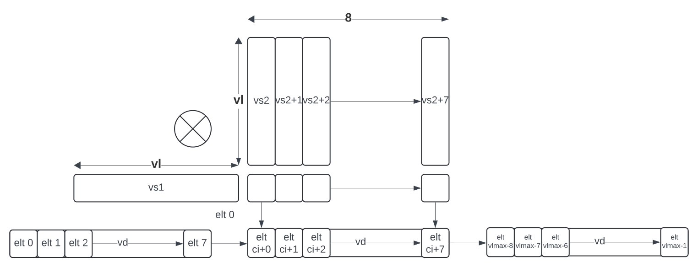

:le: ≤
:ge: ≥
:dot-version: 0.1

= `Zvldot` and `Zvbdot` Families of Dot-Product Extensions, Version {dot-version}

This document describes several extensions that accelerate the computation
of Euclidean inner products, a.k.a. dot products.
The extensions fall into two classes: _long_ dot products between two vectors,
producing a scalar result; and _batched_ dot products, wherein one vector is
broadcast to eight vectors to perform eight dot produts, producing a vector of
eight results.
Both classes support a variety of data formats, including widening
accumulations.

== `Zvldot` Family of Long Dot-Product Extensions, Version {dot-version}

Each extension in the `Zvldot` family adds one or more instructions that
compute a dot product between two vector register groups, identified by
`vs2` and `vs1`, producing a scalar result that is accumulated into element
0 of vector register `vd`.

NOTE: The name "long dot product" was chosen to distinguish these instructions
from those in the `Zvqdotq` extension, which compute multiple fixed-length
dot products, as opposed to one VLMAX-element product.

The `vs2` and `vs1` register groups have EMUL=LMUL and EEW=SEW.
The `vd` register always has EMUL=1; its EEW depends on the instruction.

These instructions are maskable.
Inactive elements are substituted with the bit pattern of all zeros, then the
computation is performed as though the instruction were not masked and
`vl`=VLMAX.

These instructions always report exceptions with a `vstart` of 0;
executing one with a nonzero `vstart` is reserved.

NOTE: Non-accumulating variants are not provided; `vd[0]` can be initialized
to zero to effect this operation.

=== `Zvqldot8i` 8-bit Integer Dot-Product Extension, Version {dot-version}

The Zvqldot8i extension adds two instructions, each of which computes a dot
product between two 8-bit integer vectors, accumulating into a 32-bit scalar.
The `vqldotu.vv` instruction treats the `vs2` operand as unsigned 8-bit
integers, whereas the `vqldots.vv` instruction treats the `vs2` operand
as signed 8-bit integers.
The `vtype`.`altfmt` field selects the signedness of the `vs1` operand,
with 0 indicating unsigned and 1 indicating signed.
These instructions are reserved unless SEW=8.
The `vd` operand has EEW=4*SEW.

----
# Zvqldot8i 8-bit integer long dot-product instructions
# signedness of vs1 supplied by altfmt (0 unsigned, 1 signed)
vqldotu.vv vd, vs2, vs1, vm   # vd[0] += unsigned(vs2) dot vs1
vqldots.vv vd, vs2, rs1, vm   # vd[0] += signed(vs2) dot vs1
----

These dot products are computed modulo 2^32^; overflow is ignored.

The instructions are encoded in major opcode 0x77 with funct3=0,
and with funct6=0x26 for `vqldotu.vv` and funct6=0x27 for
`vqldots.vv`.

=== `Zvfwldot16bf` BF16 Dot-Product Extension, Version {dot-version}

The Zvfwldot16bf extension adds one instruction, `vfwldot.vv`, which computes
a dot product between two BF16 vectors, accumulating into an FP32 scalar.
The instruction is reserved unless `vtype`.`altfmt`=1 and SEW=16.
The `vd` operand has EEW=2*SEW.

----
# Zvfwldot16bf BF16 long dot-product instruction
# altfmt=1
vfwldot.vv vd, vs2, vs1, vm   # vd[0] += vs2 dot vs1
----

These dot products are computed using the bulk-normalization scheme defined in
Section <<#RVBNA>>.

The `vfwldot.vv` instruction is encoded in major opcode 0x77 with funct3=1 and funct6=0x24.

NOTE: A future extension could define an instruction that uses the same code
points with `vtype`.`altfmt`=0 to compute IEEE 754 FP16 dot products.

=== `Zvfqldot8f` OCP FP8 Dot-Product Extension, Version {dot-version}

The Zvfqldot8f extension adds two instructions, each of which computes a dot
product between two OCP FP8 vectors, accumulating into an FP32 scalar.
The `vfqldot.vv` instruction treats the `vs2` operand as E4M3 numbers,
whereas the `vfqldot.alt.vv` instruction treats the `vs2` operand
as E5M2 numbers.
The `vtype`.`altfmt` field selects the datatype of the `vs1` operand,
with 0 indicating E4M3 and 1 indicating E5M2.
These instructions are reserved unless SEW=8.
The `vd` operand has EEW=4*SEW.

----
# Zvfqldot8f OCP FP8 long dot-product instructions
# format of vs1 supplied by altfmt (0 E4M3, 1 E5M2)
vfqldot.vv     vd, vs2, vs1, vm   # vd[0] += E4M3(vs2) dot vs1
vfqldot.alt.vv vd, vs2, rs1, vm   # vd[0] += E5M2(vs2) dot vs1
----

These dot products are computed using the bulk-normalization scheme defined in
Section <<#RVBNA>>.

The instructions are encoded in major opcode 0x77 with funct3=1,
and with funct6=0x26 for `vfqldot.vv` and funct6=0x27 for
`vfqldot.alt.vv`.

== `Zvbdot` Family of Batched Dot-Product Extensions, Version {dot-version}

Batched dot product instructions compute up to eight dot products at a time.
Each instruction in these extensions treats `vs1` as an EMUL=1 vector register
group and `vs2` as an EMUL=8 vector register group, computing eight independent
dot products between `vs1` and each of the eight vector registers within `vs2`.
The vector of eight results is accumulated into `vd`, an EMUL=`ceil(8*EEW/VLEN)`
vector register group.

The vector-length register `vl` sets the length of each of the eight dot
products.
Tail elements are substituted with the bit pattern of all zeros, then the
computation is performed as though `vl`=VLMAX.

image::bdot-simple.svg[Static, pdfwidth=4in, title="Zvbdot operation, VLEN &#8804; 8*EEW"]

For long-vector implementations with VLEN > 8*EEW, each instruction also has
a 3-bit scaled-by-8 immediate `ci` indicating which eight elements of `vd`
destination vector are read and written.
The instruction is reserved if `ci` {ge} `VLEN/(8*EEW)`.

NOTE: The ability to use all of `vd` improves the efficiency of register-tiled
matrix multiplication.



Each instruction is optionally masked by the `v0` mask register.
If masked and the mask bit corresponding to the destination element in `vd` is clear,
the corresponding dot product is not performed, and the destination element is updated
in accordance with the mask policy in `vtype`.`vma`.

The following pseudocode describes the instructions' operation:

```
for n in [0, 7]
  if (unmasked or mask[ci + n])
    for k in [0, vl-1]
      v[vd][ci + n] += v[vs2 + n][k] * v[vs1][k]
```

These instructions always report exceptions with a `vstart` of 0;
executing one with a nonzero `vstart` is reserved.

[NOTE]
====
Batched dot-product instructions can be thought of as performing 1x``vl``x8
matrix multiplication.
For `C += A*B`, `vs1` holds one row of A, `vs2` holds eight columns of B, and
`vd` holds one row of C.

These instructions have been architected to minimize the amount of code needed
to handle the various matrix-multiplication fringe cases.
The ability to dynamically control `vl` avoids the need to specially handle
the K-dimension fringe cases when K is not a multiple of VLMAX.
Similarly, the `v0` mask handles the N-dimension fringe cases when N is not
a multiple of 8.
The M dimension has no fringe cases, since these instructions only process one
row of the A matrix at a time.
====

=== `Zvqbdot8i` 8-bit Integer Batched Dot-Product Extension

The Zvqbdot8i extension adds instructions that perform 1x8xVL matrix
multiply-accumulate operations on 8-bit integer multiplicands, accumulating
into 32-bit integers.
The `vqbdotu.vv` instruction treats the `vs2` operand as unsigned 8-bit
integers, whereas the `vqbdots.vv` instruction treats the `vs2` operand
as signed 8-bit integers.
The `vtype`.`altfmt` field selects the signedness of the `vs1` operand,
with 0 indicating unsigned and 1 indicating signed.
These instructions are reserved unless SEW=8 and LMUL=1.
The `vs1` and `vs2` operands have EEW=SEW, and the `vd` operand has
EEW=4*SEW.

----
# Zvqbdot8i 8-bit integer batched dot-product instructions
# signedness of vs1 supplied by altfmt (0 unsigned, 1 signed)
vqbdotu.vv vd, vs2, vs1, vm   # vs2 unsigned
vqbdots.vv vd, vs2, rs1, vm   # vs2 signed
----

Each dot product is computed modulo 2^32^; overflow is ignored.

The instructions are encoded in major opcode 0x77 with funct3=0,
and with funct6=0x2e for `vqbdotu.vv` and funct6=0x2f for
`vqbdots.vv`.

=== `Zvfwbdot16bf` BF16 Batched Dot-Product Extension

The Zvfwbdot16bf extension adds one instruction, `vfwbdot.vv`, which
performs a 1x8xVL matrix multiply-accumulate on BF16 multiplicands and an FP32
accumulator.
The instruction is reserved unless SEW=16, LMUL=1, and `vtype`.`altfmt`=1.
The `vs1` and `vs2` operands have EEW=SEW, and the `vd` operand has
EEW=2*SEW.

----
# Zvfwbdot16bf BF16 batched dot-product instruction
# altfmt=1
vfwbdot.vv vd, vs2, vs1, vm
----

Each dot product is computed using the bulk-normalization scheme defined in
Section <<#RVBNA>>.

The `vfwbdot.vv` instruction is encoded in major opcode 0x77 with funct3=1 and funct6=0x2c.

=== `Zvfqbdot8f` OCP FP8 Batched Dot-Product Extension

The Zvfqbdot8f extension adds instructions that perform 1x8xVL matrix
multiply-accumulate operations on 8-bit OCP FP8 multiplicands, accumulating
into FP32.
The `vfqbdot.vv` instruction treats the `vs2` operand as E4M3 numbers,
whereas the `vfqbdot.alt.vv` instruction treats the `vs2` operand
as E5M2 numbers.
The `vtype`.`altfmt` field selects the datatype of the `vs1` operand,
with 0 indicating E4M3 and 1 indicating E5M2.
These instructions are reserved unless SEW=8 and LMUL=1.
The `vs1` and `vs2` operands have EEW=SEW, and the `vd` operand has
EEW=4*SEW.

----
# Zvfqbdot8f OCP FP8 batched dot-product instructions
# format of vs1 supplied by altfmt (0 E4M3, 1 E5M2)
vfqbdot.vv     vd, vs2, vs1, vm   # vs2 E4M3
vfqbdot.alt.vv vd, vs2, rs1, vm   # vs2 E5M2
----

Each dot product is computed using the bulk-normalization scheme defined in
Section <<#RVBNA>>.

The instructions are encoded in major opcode 0x77 with funct3=1,
and with funct6=0x2e for `vfqbdot.vv` and funct6=0x2f for
`vfqbdot.alt.vv`.

=== `Zvfbdot32f` FP32 Batched Dot-Product Extension

The Zvfbdot32f extension adds one instruction, `vfbdot.vv`, which performs
a 1x8xVL matrix multiply-accumulate on FP32 multiplicands and an FP32 accumulator.
The instruction is reserved unless SEW=32 and LMUL=1.
The `vs1`, `vs2`, and `vd` operands all have EEW=SEW.

----
# Zvfbdot32f FP32 batched dot-product instruction
vfbdot.vv vd, vs2, vs1, vm
----

The intermediate FP32 products may either be kept in full precision or may be rounded
to FP32 according to the dynamic rounding mode.
The sum of these dot products and the accumulator must be as though computed by the
`vfredusum.vs` instruction with SEW=32.

NOTE: This formulation allows significant implementation flexibility while being sufficiently
precise to implement SGEMM.

The `vfbdot.vv` instruction is encoded in major opcode 0x77 with funct3=1 and funct6=0x2b.

=== Sample matrix-multiplication code

Following is an optimized inner loop for 8-bit signed integer matrix
multiplication, accumulating into 32-bit integers, for row-major A and C and
column-major B.
To demonstrate use of the `ci` immediate, we assume VLEN {ge} 512, hence `vd`
can hold at least 16 elements of C.
Each loop iteration processes one 15xVLx16 tile, performing 31 unit-stride loads
of length VL, for 7.7 MACCs per loaded element.
For clarity, the loop is not scheduled.

```
loop:
  vsetvli t3, a0, e8alt, m1, ta, ma

  # Load 16 columns of B into v0-v15
  add a6, a3, t1
  vle8.v v0, (a6)
  add a6, a6, a4
  vle8.v v1, (a6)
  add a6, a6, a4
  vle8.v v2, (a6)
  add a6, a6, a4
  vle8.v v3, (a6)
  add a6, a6, a4
  vle8.v v4, (a6)
  add a6, a6, a4
  vle8.v v5, (a6)
  add a6, a6, a4
  vle8.v v6, (a6)
  add a6, a6, a4
  vle8.v v7, (a6)
  add a6, a6, a4
  vle8.v v8, (a6)
  add a6, a6, a4
  vle8.v v9, (a6)
  add a6, a6, a4
  vle8.v v10, (a6)
  add a6, a6, a4
  vle8.v v11, (a6)
  add a6, a6, a4
  vle8.v v12, (a6)
  add a6, a6, a4
  vle8.v v13, (a6)
  add a6, a6, a4
  vle8.v v14, (a6)
  add a6, a6, a4
  vle8.v v15, (a6)

  # Load 1 row of A into v31; macc into v16
  add a6, a1, t1
  vle8.v v31, (a6)
  vqbdots.vv v16, v31, v0, 0
  vqbdots.vv v16, v31, v8, 8

  # Load 1 row of A into v31; macc into v17
  add a6, a6, a2
  vle8.v v31, (a6)
  vqbdots.vv v17, v31, v0, 0
  vqbdots.vv v17, v31, v8, 8

  # etc., total of 15 times
  add a6, a6, a2
  vle8.v v31, (a6)
  vqbdots.vv v18, v31, v0, 0
  vqbdots.vv v18, v31, v8, 8
  add a6, a6, a2
  vle8.v v31, (a6)
  vqbdots.vv v19, v31, v0, 0
  vqbdots.vv v19, v31, v8, 8
  add a6, a6, a2
  vle8.v v31, (a6)
  vqbdots.vv v20, v31, v0, 0
  vqbdots.vv v20, v31, v8, 8
  add a6, a6, a2
  vle8.v v31, (a6)
  vqbdots.vv v21, v31, v0, 0
  vqbdots.vv v21, v31, v8, 8
  add a6, a6, a2
  vle8.v v31, (a6)
  vqbdots.vv v22, v31, v0, 0
  vqbdots.vv v22, v31, v8, 8
  add a6, a6, a2
  vle8.v v31, (a6)
  vqbdots.vv v23, v31, v0, 0
  vqbdots.vv v23, v31, v8, 8
  add a6, a6, a2
  vle8.v v31, (a6)
  vqbdots.vv v24, v31, v0, 0
  vqbdots.vv v24, v31, v8, 8
  add a6, a6, a2
  vle8.v v31, (a6)
  vqbdots.vv v25, v31, v0, 0
  vqbdots.vv v25, v31, v8, 8
  add a6, a6, a2
  vle8.v v31, (a6)
  vqbdots.vv v26, v31, v0, 0
  vqbdots.vv v26, v31, v8, 8
  add a6, a6, a2
  vle8.v v31, (a6)
  vqbdots.vv v27, v31, v0, 0
  vqbdots.vv v27, v31, v8, 8
  add a6, a6, a2
  vle8.v v31, (a6)
  vqbdots.vv v28, v31, v0, 0
  vqbdots.vv v28, v31, v8, 8
  add a6, a6, a2
  vle8.v v31, (a6)
  vqbdots.vv v29, v31, v0, 0
  vqbdots.vv v29, v31, v8, 8
  add a6, a6, a2
  vle8.v v31, (a6)
  vqbdots.vv v30, v31, v0, 0
  vqbdots.vv v30, v31, v8, 8

  # repeat until K dimension exhausted
  sub a0, a0, t3
  add t1, t1, t3
  bnez a0, loop
```

[#RVBNA]
== RISC-V Bulk Normalization Algorithm

This section defines the RISC-V Bulk Normalization Algorithm (RVBNA), a scheme
employed by multiple RISC-V extensions for efficient computation of
floating-point dot products.

A correctly rounded dot product is costly, and many applications do not
require such a degree of accuracy.
RVBNA reduces circuit cost and delay in exchange for a slight reduction in
accuracy using _bulk normalization_, wherein all products are aligned with
respect to a common exponent, called the _maximum reference exponent_, or
`max_exp`.
Aligned products are rounded to an intermediate precision according to round-to-odd (RTO), then summed.
The sum is then rounded to the target precision according to RTO, but unlike
RTO, out-of-range values are rouned to infinity, instead of the largest
representable number.

Formally, bulk normalization is characterized by multiple parameters:

- `p`: the size of each factor's significand (significand product is `2p`-bit wide, signed product is `2p+1`-bit wide)
- `e`: the size of each factor's biased exponent` (the bias is `2^(e-1) - 1`)
- `q`: the size of the result's significand
- `f`: the size of the result's biased exponent (the bias is `2^(f-1) - 1`)
- `n`: the number of products accumulated
- `o`: the number of overflow bits
- `g`: the number of guard bits

`o` is defined to accommodate any carry overflow and is defined to be `ceil(log2(n))`.

The number of guard bits, `g`, is also defined to be `ceil(log2(n))`.

Informally, RVBNA works as follows:

- Computing maximum exponent `max_exp`:
**** Computing each product and the addend **reference exponent** (details in <<#RVBNAReferenceExponent>>)
**** Computing `max_exp`, the maximum of the **reference exponents**
- Aligning product magnitudes on `max_exp` (2 integer bits and `2*p-2` fractional bits)
**** Each product is extended to `q-1+g` fractional bits (right padding of `(q-1+g) - (2*p-2)` zeros)
**** Each extended product is right shifted by its reference exponent subtracted from `max_exp` (discarded significand bits are OR-reduced with any trailing bits when performing RTO)
- Rounding to odd each aligned product magnitude
- Selecting an accumulator sign `S`, negating the aligned-rounded product(s) whose sign does not match `S`
- Accumulating the rounded products. If the final sum is negative, negate it and negate `S` as well
- Normalizing/Denormalizing the result and round it to odd to binary32 mantissa `M`, computing the result exponent, `E`
- Building output result from `S`, `E`, and `M`

Bulk Normalization is illustrated by Figure <<#RVBNAFig>>. 4 products are aligned.
For the two bottom products, some bits fall under the guard bit limits. For each product those bits are OR-ed into the least significant guard bit.

[#RVBNAFig]
.RISC-V Bulk Normalization Algorithm


The following is a functional description of bulk normalization:
```
// n is the static dimension of the dot product (a power of two)
// In this specification, the number of guard bits, g, and the number of
// overflow bits, o, are defined as:
// g = o = log2(n)
//
// A[i] and B[i] are IEEE-encoded floating point numbers on (e+p) bits
// (MSB is sign, next e bits are biased exponent, last m bits are the mantissa)
// exponent bias is prodOpBias 
// p = m + 1
// the output is an IEEE-encoded floating-point number on (f+q) bits
// f is the output exponent width and
// q is the size of the output significand (q - 1 is the size of the output mantissa)
BulkNormalizedDotProduct(A[n], B[n]) {
   let maxExp = 0
   let maskExp = (1 << e) - 1 // bitmask for exponent
   let maskMant = (1 << m) - 1 // bitmask for mantissa
   let prodRefExps[n] = {0} // array of product reference exponents
   let prodSigns[n] = {0} // array of product signs
   let prodSigs[n] = {0} // array of significand products

   // boundary for exponent overflow (output format)
   // this is also the output exponent for infinity and NaN
   let overflowExp = (1 << f) - 1


   // predicate output special cases
   let nanResult = false
   let invalidFlag = false
   let infinite = false
   let infiniteSign = 0

    // determining maximum reference exponent
    for i in 0 to n - 1
        // extracting A[i] and B[i]'s encoded exponents
        // (which are also used as reference exponents for product aligment)
        let A_i_exp = (A[i] >> m) & maskExp
        let B_i_exp = (B[i] >> m) & maskExp
        let A_i_mant = (A[i] & maskMant)
        let B_i_mant = (B[i] & maskMant)
        let A_i_sign = (A[i] >> (e + m)) & 0x1
        let B_i_sign = (B[i] >> (e + m)) & 0x1

        prodSigns[i] = A_i_sign ^ B_i_sign

        let A_i_isSub = A_i_exp == 0
        let B_i_isSub = B_i_exp == 0
        let A_i_isZero = (A_i_isSub && A_i_mant == 0)
        let B_i_isZero = (B_i_isSub && B_i_mant == 0)
        let prod_isZero = A_i_isZero || B_i_isZero

        // detecting corner cases
        let A_i_isInf = (A_i_exp == maskExp) && (A_i_mant == 0)
        let B_i_isInf = (B_i_exp == maskExp) && (B_i_mant == 0)
        let A_i_isNaN = (A_i_exp == maskExp) && (A_i_mant != 0)
        let B_i_isNaN = (B_i_exp == maskExp) && (B_i_mant != 0)
        let A_i_isSNaN = A_i_isNaN && (A_i_mant & (1 << (m - 1))) == 0
        let B_i_isSNaN = B_i_isNaN && (B_i_mant & (1 << (m - 1))) == 0

        let invalidProd = (A_i_isInf && B_i_isZero) || (B_i_isInf && A_i_isZero)
        let infiniteProdLHS = (A_i_isInf && !B_i_isNaN  && !B_i_isZero)
        let infiniteProdRHS = (B_i_isInf && !A_i_isNaN  && !A_i_isZero)
        let infiniteProd = infiniteProdLHS || infiniteProdRHS
        let invalidSum = infinite && infiniteProd && (infiniteSign != prodSigns[i])

        infinite ||= infiniteProd
        invalidFlag ||= invalidProd || invalidSum || A_i_isSNaN || B_i_isSNaN
        infiniteSign = infiniteProd ? prodSigns[i] : infiniteSign

        nanResult ||= A_i_isNaN || B_i_isNaN || invalidProd || invalidSum

        let A_i_sig = ((!A_i_isSub) << (p - 1)) | A_i_mant 
        let B_i_sig = ((!B_i_isSub) << (p - 1)) | B_i_mant

        prodSigs[i] =  A_i_sig * B_i_sig

        let A_i_ref_exp = (A_i_isSub ? 1 : A_i_exp)
        let B_i_ref_exp = (B_i_isSub ? 1 : B_i_exp)

        prodRefExps[i] = prod_isZero ? 0 : A_i_ref_exp + B_i_ref_exp

        maxExp = (prodRefExps[i] > maxExp ? prodRefExps[i] : maxExp)
    end for

    
    // early exit for special cases
    if (nanResult) {
        if (invalidFlag) {
            raise invalid flag
        }
        // canonical quiet NaN
        return (overflowExp << (q - 1)) | (1 << (q - 2))
    } else if (infinite) {
        return (infiniteSign << (q + f - 1)) | (overflowExp << (q - 1))
    }

    let alignedProducts[n] = {0}
    // aligning products
    for i in 0 to n - 1
        let alignShift = maxExp - prodRefExps[i]

        // aligning i-th product
        let padRight = q + 1 + g - (2 * p)
        alignedProducts[i] = (prodSigs[i] << padRight) >> alignShift

        // evaluating values of discarded bits
        // a mask is built to extract the discarded bits
        // - mask=0 if alignShift is <= q+1+g-2*p
        // - mask=(1 << (2*p)) - 1 if alignShift=q+1+g
        let discardedMask = ((1 << (2*p)) - 1) >> (q + 1 + g - alignShift)
        let discardedBits = prodSigs[i] & discardedMask
        let jam = (alignShift >= (q+1+g) ? prodSigs[i] : discardedBits) != 0

        alignedProducts[i] |= (jam ? 1 : 0) // rounding to odd aligned product
    end for

    // accumulating products
    let accumulator = 0
    for i in 0 to n - 1
        accumulator += prodSigns[i] ? -alignedProducts[i] : alignedProducts[i]
    end for

    // computing accumulator absolute value and normalizing it
    let accSign = accumulator < 0
    let accAbs = accSign ? -accumulator : accumulator;
    let lzc = LZC(accAbs) // leading zero count assuming g + q + 1 + o width

    let resExp = accumulator == 0 ? 0 : ((maxExp + o + 1 - lzc) - prodOpBias)
    let unroundedSig = (accAbs << lzc) >> (g + o + 1)
    let rawJamMask = (1 << (g + o + 1)) - 1
    let jamMask = (rawJamMask >> (lzc > (g + o + 1) ? 0 : (g + o + 1 - lzc)))

    let jamSig = ((accAbs << lzc) & jamMask) != 0
    let roundedSig = unroundedSig | (jamSig ? 1 : 0)

    if (accAbs == 0) {
        // a zero result is always +0
        return 0
    } else if (resExp >= overflowExp) {
        // overflow
        raise overflow flag
        return (accSign << (q + f - 1)) | overflowExp << (q - 1)
    } else if (resExp >= 1) {
        // normal output
        let roundedMant = roundedSig & ((1 << (q - 1)) - 1)
        return (accSign << (q + f - 1)) | (resExp << (q - 1)) | roundedMant
    } else {
        if (resExp < -(q - 1)) {
            return (accSign << (q + f - 1)) | (accAbs != 0 ? 1 : 0)
        } else {
            // denormalization and final round-to-odd
            // (of bits discarded during denormalization)
            let denormalizedSig = accAbs >> (q - 1 + resExp)
            let discardedMask = ((1 << (q - 1)) - 1) >> (q - 1 + resExp)
            let discardedBits = accAbs & discardedMask
            let forceLSB =  (discardedBits != 0 ? 1 : 0)
            return (accSign << (q + f - 1)) | denormalizedSig | forceLSB
        }
    }
}
```

Note:: For the 2D dot product, it is possible to choose the sign of the accumulator to be the sign of the smaller (magnitude) product if it differs from the sign of the larger product. This way, the larger product can be (bitwise) negated while the smaller product is aligned and rounded.

Note:: In the current specification the most significant bit of the max product has a weight of `max_exp + 1`, which means that there are `q-2+g` fractional bits in the max product. `g` could be increased to `ceil(log2(n)) + 1` to ensure the number of fractional bits is at least `q-1` (identical to the output format). Numerical impacts of the value of `g` have not been evaluated. 

Note:: Any one of the `2*p` bits of the max product can be the leading bit due to leading zeros in subnormal inputs. It is also possible for the maximum product to have more leading zeros than the other products (including when product alignment is taken into account). This is discussed in more detailed in the next section <<#RVBNAReferenceExponent>>.

[#RVBNAReferenceExponent]
==== Reference Exponent

The **reference exponent** is a proxy to the product exponent used to determine the largest product and to align the smaller products with respect to it.


The **reference exponent** of a product is evaluated as the sum of the factors' biased exponents.
If a non-zero factor is subnormal then biased `emin_normal` (`=1`) is used as its biased exponent, for purposes of computing the **reference exponent**.

Note:: the minimal reference exponent for a non-zero product is `2` (`emin_normal + emin_normal`).

If a product operand is zero then the product exponent is set to a value which ensures that every non-zero product is considered greater than every zero product when determining the maximum product. A zero product should not force any loss of accuracy on non-zero products.

Note:: for a dot product where the left hand side vector and the right hand side vector have different formats then the bias used for the exponent may differ.
This bias has no impact on the difference between the **reference exponents**.

Note:: The **reference exponent** may differ from the product exponent (with the latter being defined as the exponent of the leading non-zero digit of the product). For example it does not take into account the actual number of leading zeros of the product (which can be large if at least one of the operand is subnormal). This simplification implies that the `max_exp` used to align products may not actually be that close to the real exponent of the maximum product and the maximum product could even be different from the one that set `max_exp`. Using the reference exponent rather the real exponent simplifies the product exponent evaluation and comparison logic.


=== Rounding modes

For floating-point dot product operations, RVBNA only supports rounding-to-odd (RTO) with some specificites (see <<#RVBNARTO>>).

For floating-point multiply operations, RVBNA supports all the rounding modes mandated by RISC-V **F** extension.

For integer operations, no rounding is required.

[#RVBNARTO]
=== Rounding to Odd behavior in dot product mode

Rounding to odd (RTO) is not part of the IEEE-754 standard (at least not until and including revision 2019).

The version used for the dot product operation admits two divergences with the generally accepted definition:

- When overflowing, an infinity result is returned (rather than the largest magnitude normal number) see <<#RVBNAOverflow>>
- A zero result is always positive (+0) whatever the sign of the actual zero term of the dot product sum


=== Support for subnormal numbers

RVBNA supports subnormal values for both inputs and outputs:

- the subnormal inputs are not normalized before or after the product
- the biased subnormal input exponent is fixed to `emin_normal` for each subnormal operand when computing the product reference exponent (used to evaluate `max_exp` and shift amounts)
- the result is denormalized before the final round-to-odd is applied.

=== Behavior on floating-point zeros

If the result of a dot product operation is zero, then `+0` is returned, even if `-0` would have been returned under IEEE 754 arithmetic.

=== IEEE flags

Under RVBNA, only the invalid operation and overflow exceptions can be raised.

==== Invalid operation

The invalid operation flag must be raised if at least one of the following conditions is met:

- Any of the operands is a signaling NaN
- At least one of the following conditions:
**** there are at least two products that are infinites with opposite sign
**** there is at least one product between a zero and an infinity

Note:: a product is said to be infinite when it is the product between an infinity and a non-zero finite number.

Note:: the invalid exception flag can be raised even if one of the operands is a quiet NaN (for example with `inf - inf + qNaN`, or `inf * 0 + qNaN`)

[#RVBNAOverflow]
==== Overflow

The overflow flag is raised according to the IEEE-754 definition:

> The overflow exception shall be signaled if and only if the destination format’s largest finite number is exceeded in magnitude by what would have been the rounded floating-point result were the exponent range unbounded.

The result returned in case of an overflow is infinity with the sign of the result with unbounded exponent. This diverges from a generally accepted definition of RTO (which rounds values exceeding the largest finite value to that extremum).

Note:: In rounding-to-odd (RTO), it is equivalent to detect overflow before or after rounding as RTO rounding cannot make the significand overflow and force a late exponent change. This applies whatever the choice for the result returned in case of overflow.
