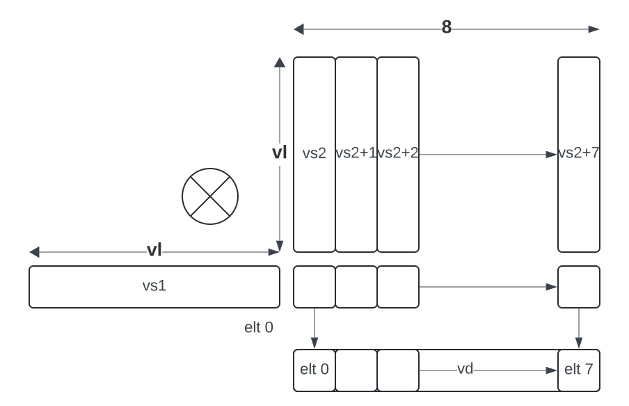
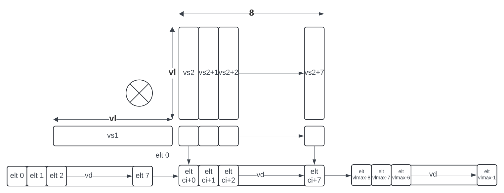
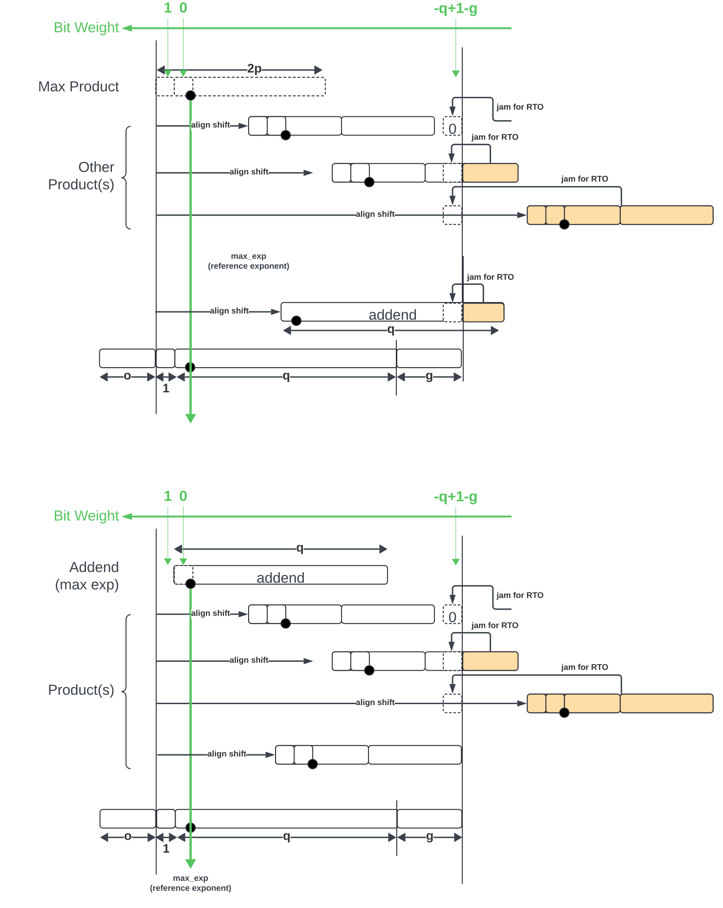

:le: &#8804;
:ge: &#8805;
:dot-version: 0.1

= `Zvldot` and `Zvbdot` Families of Dot-Product Extensions, Version {dot-version}

This document describes several extensions that accelerate the computation
of Euclidean inner products, a.k.a. dot products.
The extensions fall into two classes: _long_ dot products between two vectors,
producing a scalar result; and _batched_ dot products, wherein one vector is
broadcast to eight vectors to perform eight dot produts, producing a vector of
eight results.
Both formats support a variety of formats, including widening accumulations.

== `Zvldot` Family of Long Dot-Product Extensions, Version {dot-version}

Each extension in the `Zvldot` family adds one or more instructions that
compute a dot product between two vector register groups, identified by
`vs2` and `vs1`, producing a scalar result that is accumulated into element
0 of vector register `vd`.

NOTE: The name "long dot product" was chosen to distinguish these instructions
from those in the `Zvqdotq` extension, which compute multiple fixed-length
dot products, as opposed to one long dot product.

The `vs2` and `vs1` register groups have EMUL=LMUL and EEW=SEW.
The `vd` register always has EMUL=1; its EEW depends on the instruction.

These instructions are maskable.
Inactive elements are substituted with the bit pattern of all zeros, then the
computation is performed as though the instruction were not masked and
`vl`=VLMAX.

These instructions always report exceptions with a `vstart` of 0;
executing one with a nonzero `vstart` is reserved.

NOTE: Non-accumulating variants are not provided; `vd[0]` can be initialized
to zero to effect this operation.

=== `Zvqldot8i` 8-bit Integer Dot-Product Extension, Version {dot-version}

The Zvqldot8i extension adds two instructions, each of which computes a dot
product between two 8-bit integer vectors, accumulating into a 32-bit scalar.
The `vqldotu.vv` instruction treats the `vs2` operand as unsigned 8-bit
integers, whereas the `vqldots.vv` instruction treats the `vs2` operand
as signed 8-bit integers.
The `vtype`.`altfmt` field selects the signedness of the `vs1` operand,
with 0 indicating unsigned and 1 indicating signed.
These instructions are reserved unless SEW=8.
The `vd` operand has EEW=4*SEW.

----
# Zvqldot8i 8-bit integer dot product instructions
# signedness of vs1 supplied by altfmt (0 unsigned, 1 signed)
vqldotu.vv vd, vs2, vs1, vm   # vd += unsigned(vs2) dot vs1
vqldots.vv vd, vs2, rs1, vm   # vd += signed(vs2) dot vs1
----

Dot products are computed mod 2^32^; overflow is ignored.

=== `Zvfwldot16bf` BF16 Dot-Product Extension, Version {dot-version}

The Zvfwldot16bf extension adds one instruction, `vfwldot.vv`, which computes
a dot product between two BF16 vectors, accumulating into an FP32 scalar.
The instruction is reserved unless `vtype`.`altfmt`=1 and SEW=16.
The `vd` operand has EEW=2*SEW.

----
# Zvfwldot16bf BF16 dot product instruction
# altfmt=1
vfwldot.vv vd, vs2, vs1, vm   # vd += vs2 dot vs1
----

Dot products are computed using the bulk-normalization scheme defined in
Section <<#BulkNorm>>.

NOTE: A future extension could define an instruction that uses the same code
points with `vtype`.`altfmt`=0 to compute IEEE 754 FP16 dot products.

=== `Zvfqldot8mxf` BF16 Dot-Product Extension, Version {dot-version}

The Zvfqldot8mxf extension adds two instructions, each of which computes a dot
product between two OCP MX FP8 vectors, accumulating into an FP32 scalar.
The `vfqldot.vv` instruction treats the `vs2` operand as E4M3 numbers,
whereas the `vfqldot.alt.vv` instruction treats the `vs2` operand
as E5M2 numbers.
The `vtype`.`altfmt` field selects the datatype of the `vs1` operand,
with 0 indicating E4M3 and 1 indicating E5M2.
These instructions are reserved unless SEW=8.
The `vd` operand has EEW=4*SEW.

----
# Zvfqldot8mxf 8-bit integer dot product instructions
# format of vs1 supplied by altfmt (0 E4M3, 1 E5M2)
vfqldot.vv     vd, vs2, vs1, vm   # vd += E4M3(vs2) dot vs1
vfqldot.alt.vv vd, vs2, rs1, vm   # vd += E5M2(vs2) dot vs1
----

Dot products are computed using the bulk-normalization scheme defined in
Section <<#BulkNorm>>.

== `Zvbdot` Family of Batched Dot-Product Extensions, Version {dot-version}

Batched dot product instructions compute up to eight dot products at a time.
Each instruction in these extensions treats `vs1` as an EMUL=1 vector register
group and `vs2` as an EMUL=8 vector register group, computing eight independent
dot products between `vs1` and each of the eight vector registers within `vs2`.
The vector of eight results is accumulated into `vd`, an EMUL=`ceil(8*EEW/VLEN)`
vector register group.

These instructions are reserved unless LMUL=1.

The vector-length register `vl` sets the length of each of the eight dot
products.
Tail elements are substituted with the bit pattern of all zeros, then the
computation is performed as though `vl`=VLMAX.



For long-vector implementations with VLEN > 8*EEW, each instruction also has
a 3-bit scaled-by-8 immediate `ci` indicating which eight elements of `vd`
destination vector are read and written.
The instruction is reserved if `ci` {ge} VLMAX.

NOTE: The ability to use all of `vd` improves the efficiency of register-tiled
matrix multiplication.



Each instruction is optionally masked by the `v0` mask register.
If masked and the mask bit corresponding to the destination element in `vd` is clear,
the corresponding dot product is not performed, and the destination element is updated
in accordance with the mask policy in `vtype`.`vma`.

The following pseudocode describes the instructions' operation:

```
for n in [0, 7]
  if (unmasked or mask[ci + n])
    for k in [0, vl-1]
      v[vd][ci + n] += v[vs2 + n][k] * v[vs1][k]
```

These instructions always report exceptions with a `vstart` of 0;
executing one with a nonzero `vstart` is reserved.

[NOTE]
====
Batched dot-product instructions can be thought of as performing 1x``vl``x8
matrix multiplication.
For `C += A*B`, `vs1` holds one row of A, `vs2` holds eight columns of B, and
`vd` holds one row of C.

These instructions have been architected to minimize the amount of code needed
to handle the various matrix-multiplication fringe cases.
The ability to dynamically control `vl` avoids the need to specially handle
the K-dimension fringe cases when K is not a multiple of VLMAX.
Similarly, the `v0` mask handles the N-dimension fringe cases when N is not
a multiple of 8.
The M dimension has no fringe cases, since these instructions only process one
row of the A matrix at a time.
====

== `Zvreddot32a8i` 8-bit Integer Integrated Matrix Extension

The Zvreddot32a8i extension adds instructions that perform 1x8xVL matrix
multiply-accumulate operations on 8-bit integer multiplicands, accumulating
into 32-bit integers.
The `vqmmacc.u.vv` instruction treats the `vs2` operand as unsigned 8-bit
integers, whereas the `vqmmacc.s.vv` instruction treats the `vs2` operand
as signed 8-bit integers.
The `vtype`.`altfmt` field selects the signedness of the `vs1` operand,
with 0 indicating unsigned and 1 indicating signed.
These instructions are reserved unless SEW=8 and LMUL=1.
The `vs1` and `vs2` operands have EEW=SEW, and the `vd` operand has
EEW=4*SEW.

Each dot product is computed modulo 2^32^.

```
vqmmacc.u.vv vd, vs2, vs1, ci, vm
```

```wavedrom
{reg: [
  {bits: 7, name: 0x77},
  {bits: 5, name: 'vd'},
  {bits: 3, name: 0},
  {bits: 5, name: 'vs1'},
  {bits: 3, name: 'ci'},
  {bits: 2, name: 'vs2'},
  {bits: 1, name: 'vm'},
  {bits: 6, name: '101110'},
]}
```

```
vqmmacc.s.vv vd, vs2, vs1, ci, vm
```

```wavedrom
{reg: [
  {bits: 7, name: 0x77},
  {bits: 5, name: 'vd'},
  {bits: 3, name: 0},
  {bits: 5, name: 'vs1'},
  {bits: 3, name: 'ci'},
  {bits: 2, name: 'vs2'},
  {bits: 1, name: 'vm'},
  {bits: 6, name: '101111'},
]}
```

NOTE: Rewrite the following
NOTE: While outer products are efficient when substantial accumulator state is
added, the matrix-vector formulation has several advantages for performing
matrix multiplication within the vector registers.
It scales naturally with vector length while supporting the natural memory
layout, enabling efficient use of unit-stride loads and stores when A and
C are row-major and B is column-major.
The register operand pattern is a better fit for existing vector register file
datapaths, even moreso when the vector registers are renamed.
The high-fan-in dot products allow for a greater degree of energy savings when
using bulk-normalization schemes.
Finally, the matrix-vector formulation can speed up certain cases of
application-level matrix-vector multiplication, in particular when the matrix
is column-major and skinny.

== `Zvreddot32a16bf` BF16 Integrated Matrix Extension

The Zvreddot32a16bf extension adds one instruction, `vfwmmacc.vv`, which
performs a 1x8xVL matrix multiply-accumulate on BF16 multiplicands and an FP32
accumulator.
The instruction is reserved unless SEW=16, LMUL=1, and `vtype`.`altfmt`=1.
The `vs1` and `vs2` operands have EEW=SEW, and the `vd` operand has
EEW=2*SEW.

Each dot product is computed using the bulk-normalization scheme defined in
Section <<#BulkNormScheme>>.

NOTE: Informally, the product exponents are approximated by summing the
multiplicand exponents, modulo the bias.
For the accumulator input, the approximate exponent is its actual exponent.
The maximum of these approximate exponents is then computed.
Each summand's normalization distance is then computed by subtracting its
approximate exponent from the maximum.
Each summand is then normalized by this distance, rounding to odd.
These fixed-point summands are then added, and the final sum is converted to
the destination format, rounding to odd.

NOTE: Because most of the accumulation occurs using fixed-point carry-save arithmetic,
mandating this scheme still offers some degree of implementation flexibility.

```
vfwmmacc.vv vd, vs2, vs1, ci, vm
```

```wavedrom
{reg: [
  {bits: 7, name: 0x77},
  {bits: 5, name: 'vd'},
  {bits: 3, name: 1},
  {bits: 5, name: 'vs1'},
  {bits: 3, name: 'ci'},
  {bits: 2, name: 'vs2'},
  {bits: 1, name: 'vm'},
  {bits: 6, name: '101100'},
]}
```

NOTE: A `Zvreddot32a16f` extension that uses FP16 multiplicands instead of BF16
could also be defined, using the same opcode but with `altfmt`=0.

== `Zvreddot32a8mxf` OCP MX Integrated Matrix Extension

The Zvreddot32a8mxf extension adds instructions that perform 1x8xVL matrix
multiply-accumulate operations on 8-bit OCP MX multiplicands, accumulating
into FP32.
The `vfqmmacc.vv` instruction treats the `vs2` operand as E4M3 numbers,
whereas the `vfqmmacc.alt.vv` instruction treats the `vs2` operand
as E5M2 numbers.
The `vtype`.`altfmt` field selects the datatype of the `vs1` operand,
with 0 indicating E4M3 and 1 indicating E5M2.
These instructions are reserved unless SEW=8 and LMUL=1.
The `vs1` and `vs2` operands have EEW=SEW, and the `vd` operand has
EEW=4*SEW.

Each dot product is computed using the bulk-normalization scheme defined in
Section <<#BulkNormScheme>>.

```
vfqmmacc.vv vd, vs2, vs1, ci, vm
```

```wavedrom
{reg: [
  {bits: 7, name: 0x77},
  {bits: 5, name: 'vd'},
  {bits: 3, name: 1},
  {bits: 5, name: 'vs1'},
  {bits: 3, name: 'ci'},
  {bits: 2, name: 'vs2'},
  {bits: 1, name: 'vm'},
  {bits: 6, name: '101110'},
]}
```

```
vfqmmacc.alt.vv vd, vs2, vs1, ci, vm
```

```wavedrom
{reg: [
  {bits: 7, name: 0x77},
  {bits: 5, name: 'vd'},
  {bits: 3, name: 1},
  {bits: 5, name: 'vs1'},
  {bits: 3, name: 'ci'},
  {bits: 2, name: 'vs2'},
  {bits: 1, name: 'vm'},
  {bits: 6, name: '101111'},
]}
```

NOTE: An `Zvreddot16a8mxf` extension that accumulates into BF16 instead of FP32
could also be defined.

== `Zvreddot32a32f` FP32 Integrated Matrix Extension

The Zvreddot32a32f extension adds one instruction, `vfmmacc.vv`, which performs
a 1x8xVL matrix multiply-accumulate on FP32 multiplicands and an FP32 accumulator.
The instruction is reserved unless SEW=32 and LMUL=1.
The `vs1`, `vs2`, and `vd` operands all have EEW=SEW.

The intermediate FP32 products may either be kept in full precision or may be rounded
to FP32 according to the dynamic rounding mode.
The sum of these dot products and the accumulator must be as though computed by the
`vfredusum.vs` instruction with SEW=32.

NOTE: This formulation allows significant implementation flexibility while being sufficiently
precise to implement SGEMM.

```
vfmmacc.vv vd, vs2, vs1, ci, vm
```

```wavedrom
{reg: [
  {bits: 7, name: 0x77},
  {bits: 5, name: 'vd'},
  {bits: 3, name: 1},
  {bits: 5, name: 'vs1'},
  {bits: 3, name: 'ci'},
  {bits: 2, name: 'vs2'},
  {bits: 1, name: 'vm'},
  {bits: 6, name: '101011'},
]}
```

== Sample code

Following is an optimized inner loop for 8-bit signed integer matrix
multiplication, accumulating into 32-bit integers, for row-major A and C and
column-major B.
To demonstrate use of the `ci` immediate, we assume VLEN {ge} 512, hence `vd`
can hold at least 16 elements of C.
Each loop iteration processes one 15xVLx16 tile, performing 31 unit-stride loads
of length VL, for 7.7 MACCs per loaded element.
For clarity, the loop is not scheduled.

```
loop:
  vsetvli t3, a0, e8alt, m1, ta, ma

  # Load 16 columns of B into v0-v15
  add a6, a3, t1
  vle8.v v0, (a6)
  add a6, a6, a4
  vle8.v v1, (a6)
  add a6, a6, a4
  vle8.v v2, (a6)
  add a6, a6, a4
  vle8.v v3, (a6)
  add a6, a6, a4
  vle8.v v4, (a6)
  add a6, a6, a4
  vle8.v v5, (a6)
  add a6, a6, a4
  vle8.v v6, (a6)
  add a6, a6, a4
  vle8.v v7, (a6)
  add a6, a6, a4
  vle8.v v8, (a6)
  add a6, a6, a4
  vle8.v v9, (a6)
  add a6, a6, a4
  vle8.v v10, (a6)
  add a6, a6, a4
  vle8.v v11, (a6)
  add a6, a6, a4
  vle8.v v12, (a6)
  add a6, a6, a4
  vle8.v v13, (a6)
  add a6, a6, a4
  vle8.v v14, (a6)
  add a6, a6, a4
  vle8.v v15, (a6)

  # Load 1 row of A into v31; macc into v16
  add a6, a1, t1
  vle8.v v31, (a6)
  vqmmacc.s.vv v16, v31, v0, 0
  vqmmacc.s.vv v16, v31, v8, 8

  # Load 1 row of A into v31; macc into v17
  add a6, a6, a2
  vle8.v v31, (a6)
  vqmmacc.s.vv v17, v31, v0, 0
  vqmmacc.s.vv v17, v31, v8, 8

  # etc., total of 15 times
  add a6, a6, a2
  vle8.v v31, (a6)
  vqmmacc.s.vv v18, v31, v0, 0
  vqmmacc.s.vv v18, v31, v8, 8
  add a6, a6, a2
  vle8.v v31, (a6)
  vqmmacc.s.vv v19, v31, v0, 0
  vqmmacc.s.vv v19, v31, v8, 8
  add a6, a6, a2
  vle8.v v31, (a6)
  vqmmacc.s.vv v20, v31, v0, 0
  vqmmacc.s.vv v20, v31, v8, 8
  add a6, a6, a2
  vle8.v v31, (a6)
  vqmmacc.s.vv v21, v31, v0, 0
  vqmmacc.s.vv v21, v31, v8, 8
  add a6, a6, a2
  vle8.v v31, (a6)
  vqmmacc.s.vv v22, v31, v0, 0
  vqmmacc.s.vv v22, v31, v8, 8
  add a6, a6, a2
  vle8.v v31, (a6)
  vqmmacc.s.vv v23, v31, v0, 0
  vqmmacc.s.vv v23, v31, v8, 8
  add a6, a6, a2
  vle8.v v31, (a6)
  vqmmacc.s.vv v24, v31, v0, 0
  vqmmacc.s.vv v24, v31, v8, 8
  add a6, a6, a2
  vle8.v v31, (a6)
  vqmmacc.s.vv v25, v31, v0, 0
  vqmmacc.s.vv v25, v31, v8, 8
  add a6, a6, a2
  vle8.v v31, (a6)
  vqmmacc.s.vv v26, v31, v0, 0
  vqmmacc.s.vv v26, v31, v8, 8
  add a6, a6, a2
  vle8.v v31, (a6)
  vqmmacc.s.vv v27, v31, v0, 0
  vqmmacc.s.vv v27, v31, v8, 8
  add a6, a6, a2
  vle8.v v31, (a6)
  vqmmacc.s.vv v28, v31, v0, 0
  vqmmacc.s.vv v28, v31, v8, 8
  add a6, a6, a2
  vle8.v v31, (a6)
  vqmmacc.s.vv v29, v31, v0, 0
  vqmmacc.s.vv v29, v31, v8, 8
  add a6, a6, a2
  vle8.v v31, (a6)
  vqmmacc.s.vv v30, v31, v0, 0
  vqmmacc.s.vv v30, v31, v8, 8

  # repeat until K dimension exhausted
  sub a0, a0, t3
  add t1, t1, t3
  bnez a0, loop
```

[#BulkNormScheme]
== Bulk Normalization


This section describes the algorithm used by the Zvreddot32a16bf and Zvreddot32a8mxf extensions to compute dot-product accumulations.
The operation natively supports different formats for the product operands (dot product) and the addend.

The operation is parametrized by the number of elements in the dot product, `n`.
It expects 3 operands: `A[]`, `B[]`, and `C`.
A and B are n-element arrays of floating-point numbers. C is a floating-point number.

The result corresponds to the sum of the n-D dot product between arrays A and B and the addend C.
The algorithm also sets two exception flags: invalid operation and overflow.
The sum is performed using a bulk-normalization algorithm described in Section <<#BulkNorm>>.


=== Rounding modes

For the final rounding of this floating-point dot product operation, this scheme only supports rounding-to-odd (RTO) with some specificities (see <<#DotProdRTO>>).

Note that there are other intermediate roundings (each aligned operand is rounded to odd). They are described in details in Section <<#BulkNorm>>.

[#DotProdRTO]
=== Rounding to Odd behavior in dot product mode

Rounding to odd (RTO) is not part of the IEEE-754 standard (at least not until and including revision 2019).

The version used for the dot product operation admits two divergences with the generally accepted definition:

- When overflowing, an infinity result is returned (rather than the largest magnitude normal number) see <<#Overflow>>
- A zero result is always positive (+0) whatever the sign of the actual zero term of the dot product sum


=== Support for subnormal numbers

Subnormal values for both inputs and outputs are fully supported.

- the subnormal inputs are not normalized before or after the product
- the biased subnormal input exponent is fixed to `emin_normal` for each subnormal operand when computing the product/addend reference exponent (used to evaluate `max_exp` and shift amounts)
- the result is denormalized before the final round-to-odd is applied.

[#ZeroBehavior]
=== Behavior on floating-point zeros

If the result of a dot product accumulate operation is zero then `+0` should be returned

This includes the cases where all the operands are zero: `+0` should be returned. 

Note:: This specification mandates that `+0` be returned even when summing products that would have been equal to `-0` with any standard IEEE-754 rounding modes (e.g. `-0 * 1 + -0 * 1`).


[#ExceptionFlags]
=== IEEE exception flags

Only the invalid operation and overflow flags can be raised.

Note:: Since support for the underflow flag is not included, tininess detection has no impact on functionality.

[#InvalidOperation]
==== Invalid operation

The invalid operation flag must be raised if at least one of the following conditions is met:

- Any of the operands is a signaling NaN
- At least one of the following conditions:
**** there are at least two products that are infinites with opposite sign
**** there is at least one product between a zero and an infinity


Note:: A product is said to be infinite when it is the product between an infinity and a non-zero finite number.

Note:: The invalid exception flag can be raised even if one of the operands is a quiet NaN (for example with `inf - inf + qNaN`, or `inf * 0 + qNaN`)

[#Overflow]
==== Overflow

The overflow flag is raised according to the IEEE-754 definition:

> The overflow exception shall be signaled if and only if the destination format’s largest finite number is exceeded in magnitude by what would have been the rounded floating-point result were the exponent range unbounded.

The result returned in case of an overflow is infinity with the sign of the result with unbounded exponent. This diverges from a generally accepted definition of RTO (which rounds values exceeding the largest finite value to that extremum).

Note:: In rounding-to-odd (RTO), it is equivalent to detect overflow before or after rounding as RTO rounding cannot make the significand overflow and force a late exponent change. This applies whatever the choice for the result returned in case of overflow.


[#BulkNorm]
== RISC-V Bulk Normalization Algorithm

This section defines the RISC-V Bulk Normalization Algorithm (RVBNA), a scheme
employed by multiple RISC-V extensions for efficient computation of
floating-point dot products.

A correctly rounded dot product is costly, and many applications do not
require such a degree of accuracy.
RVBNA reduces circuit cost and delay in exchange for a slight reduction in
accuracy using _bulk normalization_, wherein all products are aligned with
respect to a common exponent, called the _maximum reference exponent_, or
`max_exp`.
Aligned products are rounded to an intermediate precision according to round-to-odd (RTO), then summed.
The sum is then rounded to the target precision according to RTO, but unlike
RTO, out-of-range values are rouned to infinity, instead of the largest
representable number.

Formally, bulk normalization is characterized by multiple parameters:

- `p`: the size of each factor significand (significand product is `2p`-bit wide, signed product is `2p+1`-bit wide)
- `e`: the size of each factor biased exponent` (the bias is assumed to be `2^(e-1) - 1`)
- `q`: the size of the result significand
- `f`: the size of the result biased exponent (the bias is assumed to be `2^(f-1) - 1`)
- `n`: the number of products accumulated
- `o`: the number of overflow bits
- `g`: the number of guard bits

`o` is defined to accommodate any carry overflow and is defined to be `ceil(log2(n))`.

The number of guard bits, `g`, is also defined to be `ceil(log2(n))`.

----
HERE
----

The actual bulk normalization method works as follows:

- Computing maximum exponent `max_exp`:
**** Computing each product and the addend **reference exponent** (details in <<#ReferenceExponent>>)
**** Computing `max_exp`, the maximum of the **reference exponents**
- Aligning product magnitudes on `max_exp` (2 integer bits and `2*p-2` fractional bits)
**** Each product is extended to `q-1+g` fractional bits (right padding of `(q-1+g) - (2*p-2)` zeros)
**** Each extended product is right shifted by its reference exponent subtracted from `max_exp` (discarded significand bits are OR-reduced with any trailing bits when performing RTO)
- Rounding to odd each aligned product magnitude
- Aligning the addend magnitude on `max_exp` (1 integer bits and `q-1` fractional bits)
**** The addend is extended to `q-1+g` fractional bits (right padding of `g` zeros)
**** The addend is right shifted by its reference exponent subtracted from `max_exp` (discarded significand bits are OR-reduced with any trailing bits when performing RTO)
- Rounding to odd each aligned product/addend magnitude
- Selecting an accumulator sign `S`, negating the aligned-rounded product(s)/addend whose sign does not match `S`
- Accumulating the rounded products and the addend. If the final sum is negative, negate it and negate `S` as well
- Normalizing/Denormalizing the result and round it to odd to a `(q-1)`-bit mantissa `M` (omitting implicit bit for normal results), computing the result exponent, `E`
- Building output result from `S`, `E`, and `M`
- Raising relevant IEEE flags (`invalid` and `overflow`) when applicable


Two cases of the Bulk Normalization step are illustrated by Figure <<#BulkNormFig>>. 4 products and one addend are aligned.
The top part illustrates a case where the maximum reference exponent is that of one of the products. 
The bottom part illustrates a case where maximum reference exponent is that of the addend.

In both cases, some bits of the last two products fall under the guard bit limits. For each product those bits are OR-ed into the least significant guard bit (as part of the product round-to-odd). The same can be said for the addend in the top case.

[#BulkNormFig]
.Zvreddot Bulk Normalization



The following is a functional description of bulk normalization:
```
// n is the static dimension of the dot product (it should be a power of two)
// In this specification, the number of guard bits, g, and the number of
// overflow bits, o, are defined as:
// g = o = log2(n)
//
// A[i] and B[i] are IEEE-encoded floating point numbers on (e+p) bits
// (MSB is sign, next e bits are the biased exponent, last m bits are the mantissa)
// exponent bias is prodOpBias = (1 << (e - 1)) - 1 
// p = m + 1
//
// C is an IEEE-encoded floating-point number on (f+q) bits
// exponent bias is addendBias = (1 << (f - 1)) - 1
//
// the output is an IEEE-encoded floating-point number on (f+q) bits
// f is the addend/result exponent bit width and
// q is the size of the addend/result significand
// (q - 1 is the size of the output mantissa)
BulkNormalizedDotProduct(A[n], B[n], C) {
    let maxExp = 0 // maximum reference exponent
    let maskExp = (1 << e) - 1 // bitmask for exponent
    let maskMant = (1 << m) - 1 // bitmask for mantissa
    let prodRefExps[n] = {0} // array of product reference exponents
    let prodSigns[n] = {0} // array of product signs
    let prodSigs[n] = {0} // array of significand products

    // boundary for exponent overflow (output format)
    // this is also the output exponent for infinities and NaNs
    let overflowExp = (1 << f) - 1
    
    // bias to be added to the sum of product biased exponents
    // to get the corresponding biased exponent in the output/addend format
    let prodExpOffset = -2 * prodOpBias + addendBias

    // predicate output special cases
    let nanResult = false
    let invalidFlag = false
    let infinite = false
    let infiniteSign = 0

    // extracting C's properties
    let C_exp = (C >> (q - 1)) & overflowExp
    let C_mant = (C & ((1 << (q - 1)) - 1))
    let C_sign = (C >> (f + q - 1)) & 0x1
    let C_sig = ((!C_isSub) << (q - 1)) | C_mant

    let C_isSub = C_exp == 0
    let C_isZero = (C_isSub && C_mant == 0)

    let C_isInf = (C_exp == overflowExp) && (C_mant == 0)
    let C_isNaN = (C_exp == overflowExp) && (C_mant != 0)
    let C_isSNaN = C_isNaN && (C_mant & (1 << (q - 2))) == 0

    infinite = C_isInf
    infiniteSign = C_sign
    nanResult = C_isNaN
    invalidFlag = C_isSNaN

    // Since addend and product bias can differ, at least one of the two
    // must be rebiased. Since the addend and the result have the same
    // format it can be simpler to rebias the products
    let minExp = min(-(prodOpBias * 2) + addendBias, 0)
    maxExp = C_isZero ? minExp : ((C_isSub ? 1 : C_exp))

    // determining maximum reference exponent
    for i in 0 to n - 1
        // extracting A[i] and B[i]'s encoded exponents
        // (which are also used as reference exponents for product aligment)
        let A_i_exp = (A[i] >> m) & maskExp
        let B_i_exp = (B[i] >> m) & maskExp
        let A_i_mant = (A[i] & maskMant)
        let B_i_mant = (B[i] & maskMant)
        let A_i_sign = (A[i] >> (e + m)) & 0x1
        let B_i_sign = (B[i] >> (e + m)) & 0x1

        prodSigns[i] = A_i_sign ^ B_i_sign

        let A_i_isSub = A_i_exp == 0
        let B_i_isSub = B_i_exp == 0
        let A_i_isZero = (A_i_isSub && A_i_mant == 0)
        let B_i_isZero = (B_i_isSub && B_i_mant == 0)
        let prod_isZero = A_i_isZero || B_i_isZero

        // detecting corner cases
        let A_i_isInf = (A_i_exp == maskExp) && (A_i_mant == 0)
        let B_i_isInf = (B_i_exp == maskExp) && (B_i_mant == 0)
        let A_i_isNaN = (A_i_exp == maskExp) && (A_i_mant != 0)
        let B_i_isNaN = (B_i_exp == maskExp) && (B_i_mant != 0)
        let A_i_isSNaN = A_i_isNaN && (A_i_mant & (1 << (m - 1))) == 0
        let B_i_isSNaN = B_i_isNaN && (B_i_mant & (1 << (m - 1))) == 0

        let invalidProd = (A_i_isInf && B_i_isZero) || (B_i_isInf && A_i_isZero)
        let infiniteProdLHS = (A_i_isInf && !B_i_isNaN  && !B_i_isZero)
        let infiniteProdRHS = (B_i_isInf && !A_i_isNaN  && !A_i_isZero)
        let infiniteProd = infiniteProdLHS || infiniteProdRHS
        let invalidSum = infinite && infiniteProd && (infiniteSign != prodSigns[i])

        infinite ||= infiniteProd
        invalidFlag ||= invalidProd || invalidSum || A_i_isSNaN || B_i_isSNaN
        infiniteSign = infiniteProd ? prodSigns[i] : infiniteSign

        nanResult ||= A_i_isNaN || B_i_isNaN || invalidProd || invalidSum

        let A_i_sig = ((!A_i_isSub) << (p - 1)) | A_i_mant 
        let B_i_sig = ((!B_i_isSub) << (p - 1)) | B_i_mant

        prodSigs[i] =  A_i_sig * B_i_sig

        let A_i_ref_exp = (A_i_isSub ? 1 : A_i_exp)
        let B_i_ref_exp = (B_i_isSub ? 1 : B_i_exp)

        let nonZeroProdExp = A_i_ref_exp + B_i_ref_exp + prodExpOffset
        prodRefExps[i] = prod_isZero ? minExp : nonZeroProdExp 

        maxExp = (prodRefExps[i] > maxExp ? prodRefExps[i] : maxExp)
    end for

    
    // early exit for special cases
    if (nanResult) {
        if (invalidFlag) {
            raise invalid flag
        }
        // canonical quiet NaN
        return (overflowExp << (q - 1)) | (1 << (q - 2))
    } else if (infinite) {
        return (infiniteSign << (q + f - 1)) | (overflowExp << (q - 1))
    }

    let alignedProducts[n] = {0}
    // aligning products
    for i in 0 to n - 1
        let alignShift = maxExp - prodRefExps[i]

        // aligning i-th product
        let padRight = q + 1 + g - (2 * p)
        alignedProducts[i] = (prodSigs[i] << padRight) >> alignShift

        // evaluating values of discarded bits
        // a mask is built to extract the discarded bits
        // - mask=0 if alignShift is <= q+1+g-2*p
        // - mask=(1 << (2*p)) - 1 if alignShift=q+1+g
        let discardedMask = ((1 << (2*p)) - 1) >> (q + 1 + g - alignShift)
        let discardedBits = prodSigs[i] & discardedMask
        let jam = (alignShift >= (q+1+g) ? prodSigs[i] : discardedBits) != 0

        alignedProducts[i] |= (jam ? 1 : 0) // rounding to odd aligned product
    end for


    let alignedAddend = 0
    // aligning Addend
    {
        let alignShift = maxExp - (C_isZero ? minExp : ((C_isSub ? 1 : C_exp)))
        let padRight = g
        alignedAddend = (C_sig << padRight) >> alignShift

        // evaluating values of discarded bits
        // a mask is built to extract the discarded bits
        // - mask=0 if alignShift is <= g
        // - mask=(1 << q) - 1 if alignShift=q+g
        let discardedMask = ((1 << q) - 1) >> (q + g - alignShift)
        let discardedBits = C_sig & discardedMask
        let jam = (alignShift >= (q+g) ? C_sig: discardedBits) != 0

        alignedAddend |= (jam ? 1 : 0) // rounding to odd aligned addend
    }

    // accumulating products
    let accumulator = 0
    for i in 0 to n - 1
        accumulator += prodSigns[i] ? -alignedProducts[i] : alignedProducts[i]
    end for

    // accumulating addend
    accumulator += C_sign ? -alignedAddend : alignedAddend

    // computing accumulator absolute value and normalizing it
    let accSign = accumulator < 0
    let accAbs = accSign ? -accumulator : accumulator;
    let lzc = LZC(accAbs) // leading zero count assuming width of (g + q + 1 + o)

    // maxExp should already be properly biased at that point
    let resExp = accumulator == 0 ? 0 : (maxExp + o + 1 - lzc)
    let unroundedSig = (accAbs << lzc) >> (g + o + 1)
    let rawJamMask = (1 << (g + o + 1)) - 1
    let jamMask = (rawJamMask >> (lzc > (g + o + 1) ? 0 : (g + o + 1 - lzc)))

    let jamSig = ((accAbs << lzc) & jamMask) != 0
    let roundedSig = unroundedSig | (jamSig ? 1 : 0)

    if (accumulator == 0) {
        // a zero result is always +0
        return 0
    } else if (resExp >= overflowExp) {
        // overflow
        raise overflow flag
        return (accSign << (q + f - 1)) | overflowExp << (q - 1)
    } else if (resExp >= 1) {
        // normal output
        let roundedMant = roundedSig & ((1 << (q - 1)) - 1)
        return (accSign << (q + f - 1)) | (resExp << (q - 1)) | roundedMant
    } else {
        if (resExp < -(q - 1)) {
            return (accSign << (q + f - 1)) | (accAbs != 0 ? 1 : 0)
        } else {
            // denormalization and final round-to-odd
            // (of bits discarded during denormalization)
            let denormalizedSig = accAbs >> (q - 1 + resExp)
            let discardedMask = ((1 << (q - 1)) - 1) >> (q - 1 + resExp)
            let discardedBits = accAbs & discardedMask
            let forceLSB =  (discardedBits != 0 ? 1 : 0)
            return (accSign << (q + f - 1)) | denormalizedSig | forceLSB
        }
    }
}
```


[#ReferenceExponent]
==== Reference Exponent

The **reference exponent** is a proxy to the sum operand exponent. It is used to determine the largest operand and to align the smaller operands with respect to it.

The **reference exponent** of a product is evaluated as the sum of the factors' biased exponents, the output format bias, and minus two times the product operand bias.
If a non-zero factor is subnormal then biased `emin_normal` (`=1`) is used as its biased exponent, for purposes of computing the **reference exponent**.

The **reference exponent** of the addend is its bias exponent if it is normal, one if it is a non-zero subnormal and an extremal value described below if it is zero.

Note:: Before application of any bias, the minimal reference exponent for a non-zero product is `2` (`emin_normal + emin_normal`).

If a sum operand is zero then the reference exponent is set to a value, called the **extremal value**, which ensures that every non-zero operand is considered greater than every zero operand when determining the maximum operand. A zero product should not force any loss of accuracy on non-zero products.

Note:: For products, the **reference exponent** may differ from the actual product exponent (with the latter being defined as the exponent of the leading non-zero digit of the product). For example it does not take into account the actual number of leading zeros of the product (which can be large if at least one of the operand is subnormal). This simplification implies that the `max_exp` used to align products may not actually be that close to the real exponent of the maximum product and the maximum product could even be different from the one that set `max_exp`. Using the reference exponent rather the real exponent simplifies the product exponent evaluation and comparison logic.


[#BulkNormAccuracy]
== Appendix: discussion on the accuracy of bulk-normalization.


Using a bulk-normalized dot product represents a trade-off between accuracy and efficiency.
Using a reference exponent moves this trade-off towards more efficiency, trading-off for less accuracy.

This is in particular visible when one of the product has a subnormal operand and the other does not.
Let's take an example with a binary16 2-element dot product with a binary32 result: `a_0 * b_0 + a_1 * b_1`.

- `a_0 = 0x0.004p-14` (minimal subnormal operand), reference exponent is `-14`, real exponent is `-24`
- `b_0 = 0x1.000p0`   (`1.0`), reference exponent is `0`, real exponent is `0`
- `a_1 = 0x1.004p-12`   reference exponent is `-12`, real exponent is `-12``
- `b_1 = 0x1.004p-10`   reference exponent is `-10`, real exponent is `-10``

`a_0 * b_0` reference exponent is `-14`, `a_1 * b_1` reference exponent is `-22`.
`a_0 * b_0` appears as the greater product while it is not. 

the exact result is `0x1.40801p-22`.

When doing bulknormalization, `a_1 * b_1` is going to be right shifted and the least 4 significant bits will be jammed (as part of the product round-to-odd).
If the proper maximum exponent was used, the result would have differed and no bit would have been discarded (even without the guard bit, there is enough room in the accumulator to accommodate an exact accumulation).

The result after bulknormalization is `0x1.4081p-22` with an error of `0x1p-39`. 

Note:: Flushing subnormal inputs to zero would have made the result even worse since it would have discarded `a_0 * b_0` altogether since `a_0` is subnormal. In this case `a_0 * b_0` is larger than the discarded field from `a_1 * b_1`. If `a_0` is flushed to zero, the result would have been `0x1.00801p-22` with an error of `0x1p-24` (equal to `a_0 * b_0`).
