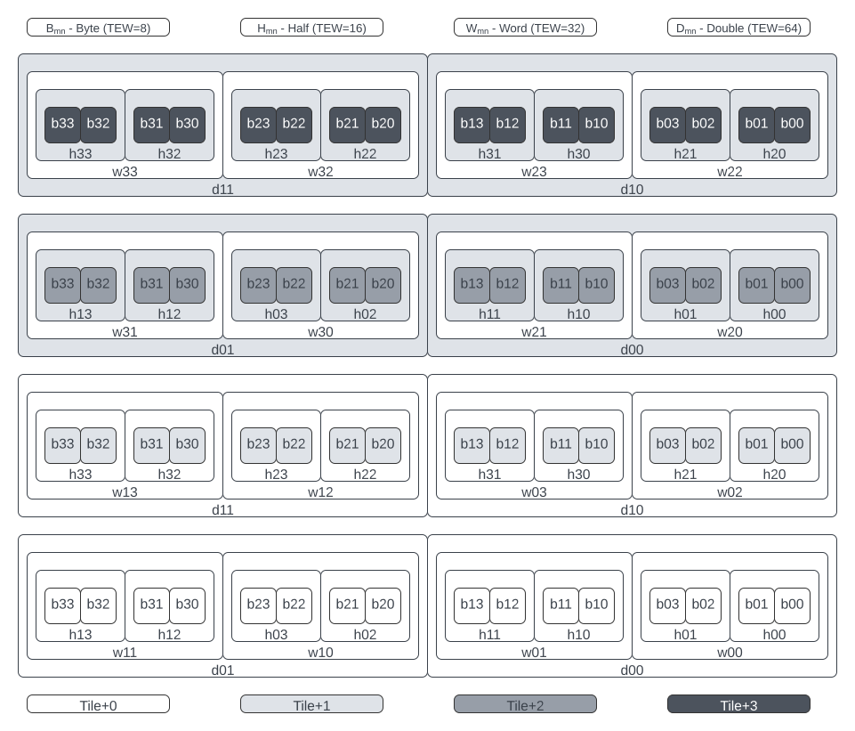
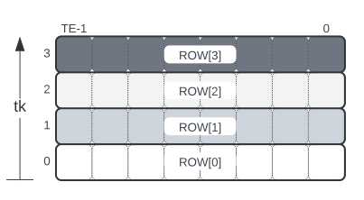
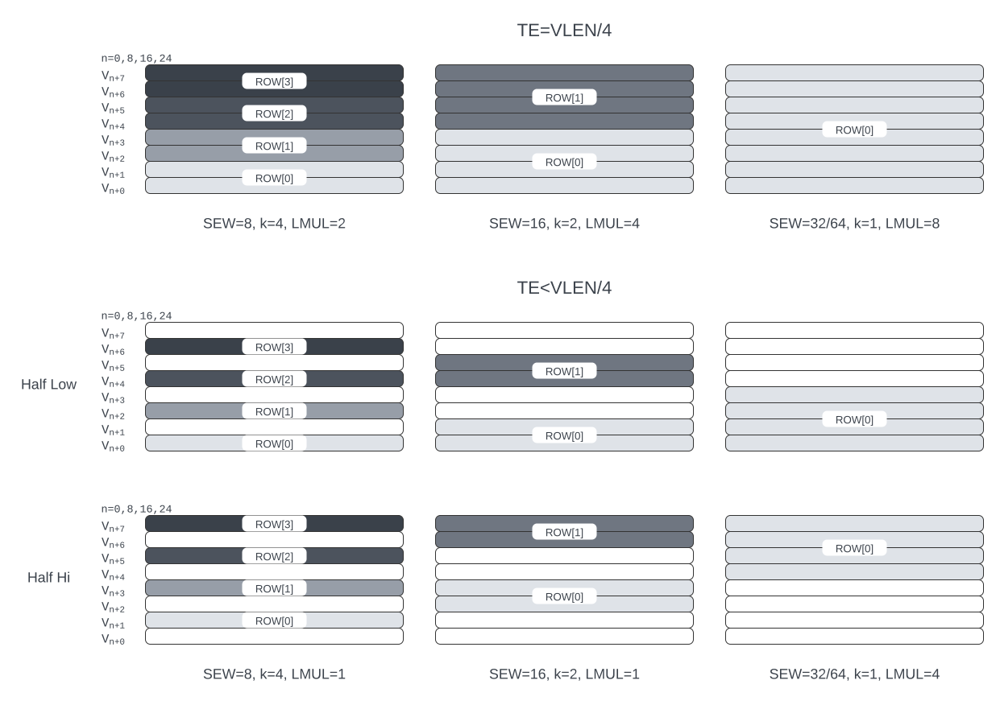

= Zvma Family of Attached Matrix Extensions
Warning! This document describes an Attached Matrix Extensions proposal from SiFive. It is not an RVIA standard.
:doctype: book
:revnumber: v0.2
:revdate: 2025/11/30
:toc: left
:toclevels: 5
:sectnums:
:figure-caption: Figure
:le: &#8804;
:ge: &#8805;
:ne: &#8800;
:approx: &#8776;
:inf: &#8734;

== Overview

The Zvma family of extensions supports high-throughput matrix-multiplication
computation.
These extensions add new architectural state to each hart in the form of
square matrix tiles.
They provide instructions that perform tall-skinny by short-wide matrix
multiplications, i.e. outer products or wide outer products.
These instructions source their operands from vector registers and accumulate
their results into the new square matrix tiles.
The inputs' data width is specified by SEW, while the accumulators' data width
is given by TEW=SEW*TWIDEN, where TWIDEN can be 1, 2, or 4, depending on the
instruction.

The new computational instructions perform the operation C[M,N] += A[K,M]^T*B[K,N],
where C is stored in the tile state.
Each of the input matrices A and B is held in a set of vector registers,
where each row of the matrix is held in a separate vector register group and
the number of rows is given by K.
The inner dimension K can be a maximum (KMAX) of 1, 2, or 4, depending on the
data type of A and B.

In addition, the Zvma extensions provide instructions to move rows and
columns of the matrix arrays, either to and from the vector registers or to
and from memory.

The Zvmabase extension provides the new architectural state and the new
configuration, move, load, store, and context-manipulation instructions.
These instructions support tile EEW (TEW) values corresponding to all
supported SEW settings (8..ELEN).

The Zvma extensions build upon the vector extensions.
The vector registers serve as a data source for matrix operands, and the
existing vector instructions are used for pre- and post-processing of matrices.
Hence, the Zvmabase extension requires the Zve32x extension.

The Zvma extensions are compatible with the RV32E, RV32I, RV64E, and RV64I base
ISAs, but it is expected that RV64I will be by far the most common base-ISA
choice.

The following table lists the computational extensions in the Zvma family.

[cols="1,1,3,3", options="header"]
|===
|Extension    | Dependencies | Multiplicand Types | Accumulator Type
|Zvma32a8i  ^| Zvmabase | [U]Int8 | Int32
|Zvma32a4f  ^| Zvmabase_Zve32f | OCP MX FP4 | FP32
|Zvma32a8f  ^| Zvmabase_Zve32f | OCP MX FP8 | FP32
|Zvma32a16f ^| Zvmabase_Zve32f | BF16, FP16 | FP32
|Zvma32a32f ^| Zvmabase_Zve32f | FP32 | FP32
|Zvma64a64f ^| Zvmabase_Zve64d | FP64 | FP64
|===

=== Matrix Tile State

The new matrix state is organized into _tiles_, where a tile is a
separately addressable two-dimensional square matrix.  The
fixed matrix state is viewed as a different number of tiles, depending
on TEW.

The ISA is optimized for the case where TEW=32, as this is the most
common accumulator size.  When TEW=32, the tiles have dimensions TExTE
elements, where TE is a parameter of the implementation.  TE is
constrained to be a power of 2, VLEN/4 >= TE >= 4.  The upper bound is
set by the requirement that a tile row or column must fit within a
single vector register group (VLEN*8 bits).  Implementations may
choose less than the maximum TE to reduce implementation cost.  The
configuration instructions, described below, support writing of
TE-agnostic code.

The ISA fixes the number of TEW=32 tiles to four (`mt0`, `mt4`, `mt8`,
`mt12`) to support all cases at reasonable performance.  The matrix
state needs to hold at least one accumulator as well as transposes of
one or both inputs to support efficient execution of all matrix
operations.  Also, providing more separately addressable tiles allows
more flexible usage of tile accumulators enabling optimizations such
as register blocking of the operands, reducing memory traffic.

----
Tile EEW  #Tiles Tile Dimensions Tile Specifiers
  8        16        TExTE       mt0,mt1,        ...,          mt14,mt15
 16         8        TExTE       mt0,mt2,mt4,mt6,mt8,mt10,mt12,mt14
 32         4        TExTE       mt0,    mt4,    mt8,     mt12
 64         8    (TE/2)x(TE/2)   mt0,mt2,mt4,mt6,mt8,mt10,mt12,mt14
----

For smaller TEW<32, the tile dimensions (TExTE) are kept the same as
TEW=32.  Every halving of TEW halves the state required for a single
tile and so the number of tiles increases by a factor of two.  The
storage of each TEW=32 tile is divided to form two TEW=16 tiles (e.g.
`mt0` for TEW=32 forms `mt0` and `mt2` for TEW=16), and the storage of
each TEW=16 tile is divided to form two TEW=8 tiles (e.g. `mt0` for
TEW=16 forms `mt0` and `mt1` for TEW=8).

For TEW=64, the tile dimensions are reduced by a factor of 2 in each
dimension (i.e. tiles are TE/2 x TE/2 elements), but the number of
tiles increases to 8 as the tile size shrinks quadratically while the
element width only doubles.  The storage of each TEW=32 tile is
divided to form two TEW=64 tiles (e.g. `mt0` for TEW=32 forms `mt0`
and `mt2` for TEW=64).

The parameter ETE describes the tile dimensions as a function of TEW:
`ETE = TEW < 64 ? TE : TE / 2`.

Additional ISA extensions describe the tile dimensions.
The Zvma__N__t extension indicates `TE` {ge} `__N__`, e.g.
Zvma32t indicates TE is at least 32.

NOTE: The accumulator array dimensions (TE) may be determined dynamically with
the `msettype` instruction to enable writing TE-agnostic software.

==== Tile Punning
The tile state is reshaped for each supported TEW which results in
tiles being combined to support wider accumulators. For example,
4 TEW=8 tiles (mt0..3) are combined to support a single TEW=32 tile
(mt0).

[NOTE]
====
Most software consistently accesses a tile using the same TEW, and so
is indifferent to the interpretation of the tile under other TEWs.
However, there are cases where software must access elements in a tile
without knowing the TEW with which it was most recently written,
including context switching and debugging.
In particular, migrating contexts between harts with different
tile-punning schemes is impractical.
Hence, it is highly desirable to fix the tile-punning scheme.

Architecturally tagging the tiles with their TEWs has been proposed as an
alternative to mandating a tile-punning scheme.
Alas, the fact that tiles can be accessed in both rows and columns makes this
scheme impractically expensive: every byte would need its own type tag.

We chose this particular layout because it enables efficient access to
elements by both row and column, supporting consecutive accesses in either
dimension without overly favoring one over the other.
====

The following figure illustrates how elements are combined and
aliased across supported TEWs.

NOTE: For better legibility, the figure uses an unsupported size of TE=4.

Viewing the tile state as a linearized buffer of 16 * TE * TE bytes,
an element's position can be determined with the following algorithm.

----
unsigned punning (
  const unsigned TE,  // tile array dimension TExTE
  unsigned tile,      // addressed tile
  unsigned row,       // tile row index
  unsigned col,       // tile col index
  unsigned tew        // tile element width
) {
  unsigned ptile, minor_offset, major_offset;

  switch (tew) {
    case 8: {
      ptile = tile;
      minor_offset = (row % 4) * 4 + (col % 4);
      major_offset = (row / 4) * (TE / 4) + (col / 4);
      break;
    }
    case 16: {
      ptile = tile + ((row & 2) >> 1);
      minor_offset = (row % 2) * 4 + (col % 2) * 2 + ((col / 2) % 2) * 8;
      major_offset = (row / 4) * (TE / 4) + (col / 4);
      break;
    }
    case 32: {
      ptile = tile + 2 * (row / (TE / 2)) + ((col & 2) >> 1);
      minor_offset = (row % 2) * 8 + (col % 2) * 4;
      major_offset = ((row / 2) % (TE / 4)) * (TE / 4) + (col / 4);
      break;
    }
    case 64: {
      ptile = tile + (row / (TE / 4));
      minor_offset = (col % 2) * 8;
      major_offset = (row % (TE / 4)) * (TE / 4) + (col / 2);
      break;
    }
    default: return 0;
  }

  unsigned offset = (ptile * TE * TE) + (major_offset * 16) + minor_offset;

  return offset;
}
----

=== Matrix Type (`mtype`) CSR

The Zvmabase extension adds a new unprivileged read-only CSR, `mtype`,
with address 0xC23.  It contains the following fields:

----
bits      field
XLEN-1:30 reserved
    21:8  tm[13:0]
     7:6  reserved
     5:3  tk[2:0]
       2  reserved
     1:0  vtwiden[1:0]
----

`tm` can hold values from 0-TE, inclusive.

`tk` can hold values from 0-4, inclusive.

If `vtwiden`==0, the matrix unit is not configured.

=== Additions to `vtype` CSR

If the Zvma32a16f extension is implemented, `altfmt` may be set to 1
when SEW=16 (indicating BF16).  Selecting `altfmt`=1 for other SEW
settings is reserved.

NOTE: We expect most implementations will set `vill` in `vtype` when
a reserved combination of `altfmt` and SEW is selected.

=== Matrix-Multiply Operations

The general form of the matrix-multiply operations is:

----
    C[tm,tn] += A[tk,tm]^T * B[tk,tn]
----

where the inputs A and B are each sourced from a vector register
group, while the accumulator C is held in a matrix tile.  A, B, and C
are all specified using register specifier fields in the instruction
encoding.

The values of `tm`, `tn`, and `tk` are obtained from CSRs.
`tm` and `tk` are fields in the `mtype` register.
`tn` is derived from `vl`; it is equal to `min(vl, ETE)`.
The new configuration
instructions described below allow the values of `tm`, `tn`, and `tk`
to be set in an implementation-agnostic manner from the application
matrix dimensions.

Each vector register group input has `tk` rows, where each row is held
separately in one or more vector registers, with the total number of
vector registers constrained to fit in one eight-register group.
Each row fits within a vector register group (i.e. an aligned power-of-2
number of vector registers) and the collection of rows also fits in
a (potentially larger) vector register group.
The value of `tk` sets the dimension
of the dot products performed for each accumulator element and the
maximum value of `tk` (KMAX) depends on the element widths, with a
maximum value of 4.

This format allows existing vector unit-stride loads to be used to
load each row of an input from a memory matrix held in row-major
format.

Successive rows are separated by (8/KMAX) vector registers.
For example, for vector register group specifier `v8`, and assuming KMAX=4 and
LMUL=2, then `v8`..`v9` holds one matrix row, `v10`..`v11` holds the next row,
`v12`..`v13` the next, and `v14`..`v15` the last.
But when KMAX=4 and LMUL=1, then `v8`, `v10`, `v12`, and `v14` hold the
successive rows of the matrix: the separation between rows is the same, but
the odd-numbered vector registers are skipped.

Vector register specifiers must be divisible by LMUL.
For example, when KMAX=4 and LMUL=2, `v8` is valid but `v9` is not.
But when KMAX=4 and LMUL=1, both are valid: the former represents the
even-numbered registers `v8`..`v14`, whereas the latter represents the
odd-numbered registers `v9`..`v15`.

NOTE: These definitions facilitate writing LMUL-agnostic software, but they do
not preclude LMUL-conscious software from using all of the vector registers.

Vector register specifiers, when taken modulo 8, must be less than 8/KMAX.
For example, when KMAX=4, `v10` is invalid.

NOTE: This constraint prevents register groups from spanning EMUL=8
register-group boundaries, simplifying vector-unit implementations.

=== Matrix Configuration Instructions

Application matrices have varied sizes, and implementations will vary
in the TE dimensions they support.  The matrix configuration
instructions allow a single binary matrix-multiply routine to work for
any size application matrix multiply on any sized matrix-multiply
implementation.

NOTE: More optimized routines are possible when microarchitectural
parameters are known to software.

The actual size of a matrix-multiply operation is determined by values
in two CSRs, `tk` and `tm` are fields in the `vtype` register, `tn`
is the same as the `vl` register.  These CSRs are set using configuration
instructions.
----
Encoding of vector and matrix configuration instructions

 31 30         25 24      20 19      15 14   12 11      7 6     0
 0 |        zimm[10:0]      |    rs1   | 1 1 1 |    rd   |1010111| vsetvli
 1 |   1|  zimm[ 9:0]       | uimm[4:0]| 1 1 1 |    rd   |1010111| vsetivli
 1 |   000000    |   rs2    |    rs1   | 1 1 1 |    rd   |1010111| vsetvl

 1 |   000010    |   00000  |   rs1/ATN| 1 1 1 |    rd   |1010111| vsettn
 1 |   000010    |   00001  |   rs1/ATM| 1 1 1 |    rd   |1010111| vsettm
 1 |   000010    |   00010  |   rs1/ATK| 1 1 1 |    rd   |1010111| vsettk
 1        6            5          5        3        5        7

ATM is application matrix m dimension
ATN is application matrix n dimension
ATK is application matrix k dimension
----

The existing `vset[i]vl[i]` instructions write zero to the `mtype` CSR.

The `msetmtype` instruction sets `vtwiden` to the specified immediate value;

The existing `vset[i]vl[i]` instructions are used to configure the hart
to execute Zvma instructions.
These instructions behave as defined in the V extension, but their behavior
is modified when the requested `vtype` value has `vtwiden` != 0.
In particular, the `vsew` and `vtwiden` fields are set as requested, but other
fields in `vtype` are determined using special rules described below.
AVL is determined as described in the V spec, but the new `vl` is determined
using a special rule described below.
`rd` is written with the new value of `vl`, as usual.
Although `vill` is set under different rules, as described below, the behavior
remains that if `vill` is set, then the other bits in `vtype`, as well as `vl`,
are set to zero.

----
vset[i]vl[i] behavior when requested vtype.vtwiden != 0

TEW = SEW * TWIDEN
ETE = TEW < 64 ? TE : TE/2 // Effective number of elements along tile edge
EVE = VLEN/SEW             // Effective number of elements in a vector register

LMUL = min(8/KMAX, 8/TWIDEN, ceil(ETE/EVE))
              ^        ^           ^
              |        |           +-matrix engine size constraint
              |        +-matrix row/col must fit in vector register group
              +-leave space for K dimension

tn/vl = min(AVL, LMUL*EVE, ETE)  // AVL is as defined in V spec
tm = min(ATM, LMUL*EVE, ETE)     // ATM comes from requested vtype.tm
tk = min(ATK, KMAX)              // ATK comes from requested vtype.tk
altfmt = ALTFMT                  // ALTFMT comes from requested vtype.altfmt
vma = 1
vta = 1

vill = (TEW > ELEN) || (any reserved field in vtype != 0)

rd = tn/vl
----

A new assembler pseudo-op, `vsettnt` ("set tn and type") is provided to
simplify using the `vsetvli` instruction for Zvma purposes.

----
// vsetvli rd, rs1, (vsew << 3) + (alt << 8) + (vtwiden << 9)
vsettnt rd, rs1, eX, wY

The valid `wY` and `eX` options are as follows.

vtwiden    assembler syntax
01        w1
10        w2
11        w4

vsew alt  assembler syntax
00     0  e8
01     0  e16
01     1  e16alt
10     0  e32
11     0  e64

An `eX, wY` combination is valid if and only if X * Y <= ELEN.
----

NOTE: `w0` is not supported--this behavior is achieved by the existing
`vset[i]vl[i]` instructions--and assemblers should reject it.

==== `vsettm`, `vsettn`, and `vsettk` instructions

These instructions set `tm`, `tn`, or `tk` to the value in `rs1`,
constrained by the current matrix configuration.
The new value of `tm`, `tn`, or `tk` is also written to the scalar destination
register `rd`.
If the matrix unit has not been configured, i.e. `vtwiden`=0 in `vtype`, the
instruction sets `vill` in `vtype`.

These instructions are included in the Zvmabase extension.

----
vsettm rd, rs1  // rd = tm = min(rs1=ATM, LMUL*EVE, ETE)
----

The `vsettm` instruction sets `tm` to be the lesser of `rs1` (ATM),
`LMUL`*`EVE`, and `ETE`.

----
vsettn rd, rs1  // rd = tn/vl = min(rs1=ATN, LMUL*EVE, ETE)
----

The `vsettn` instruction sets `tn` to be the lesser of `rs1` (ATN),
`LMUL`*`EVE`, and `ETE`.

----
vsettk rd, rs1  // rd = tk = min(rs1=ATK, KMAX)
----

The `vsettk` instruction sets `tk` to the lesser of `rs1` (ATK) and KMAX.

==== Supported SEW, TWIDEN, and KMAX values

The inner dimension specified by `tk` is used to support fused
dot-product operations on narrower datatypes to increase efficiency.
The ISA fixes maximum K values (KMAX) of matrix-multiply instructions
according to SEW and TWIDEN to simplify ISA specification of fused
arithmetic operators.

NOTE: Unlike other matrix accelerator architectures that support fusion of
narrower datatypes by flattening K into both the M and N dimensions, this
approach allows software to use standard matrix formats.

----
TEW=8

SEW  TWIDEN  KMAX
 8    1       4  (fused 4-element dot product)
----

----
TEW=16

SEW  TWIDEN  KMAX
 8    2       4  (fused 4-element dot product)
16    1       2  (fused 2-element dot product)
----

----
TEW=32

SEW  TWIDEN  KMAX
 8    4       4  (fused 4-element dot product)
16    2       2  (fused 2-element dot product)
32    1       1
----

----
TEW=64

SEW  TWIDEN  KMAX
16    4       2  (fused 2-element dot product)
32    2       1
64    1       1
----

=== Tile Subset Specifier (TSS)

For operations that move rows or columns between the tiles and vector
registers or memory, a scalar value is used to encode the set of tile
elements that are accessed and the pattern by which they are accessed.

----
bits       meaning
XLEN-1:31  reserved
 30:27     tile specifier (0-15)
 26:24     pattern (0=row, 1=col, >1 reserved)
 23:0      index within pattern (e.g. row/col index)
----

When there are fewer than 16 tiles due to the specified TEW, the
`log2(16 / #Tiles)` LSBs of the tile-specifier field are ignored,
such that this field always refers to a valid tile.

The 3-bit field for pattern currently only has two encodings defined,
row and column. The pattern field defines how the index field is
interpreted.  For the currently defined row and column patterns, the
index field is treated as an unsigned integer providing a
one-dimensional index of the row or column.
Row and column indices greater than or equal to ETE are reserved.

NOTE: We expect most implementations will ignore reserved bits in TSS,
taking `pattern` mod 2, and taking the index within the pattern mod ETE.

===  Load/Store Tile Subset to Memory

These instructions transfer tile subsets between the tile state and memory.
Implementations must provide vector loads and stores with EEWs corresponding
to all supported SEW settings (8..ELEN).
These instructions are included in the Zvmabase extension.

----
// Load tile subset from memory
vlte8  rs2, (rs1) // rs1 is memory address, rs2 is TSS
vlte16 rs2, (rs1) // rs1 is memory address, rs2 is TSS
vlte32 rs2, (rs1) // rs1 is memory address, rs2 is TSS
vlte64 rs2, (rs1) // rs1 is memory address, rs2 is TSS

// Store tile subset to memory
vste8  rs2, (rs1) // rs1 is memory address, rs2 is TSS
vste16 rs2, (rs1) // rs1 is memory address, rs2 is TSS
vste32 rs2, (rs1) // rs1 is memory address, rs2 is TSS
vste64 rs2, (rs1) // rs1 is memory address, rs2 is TSS

----

----
31 29 28 27 26 25 24    20 19   15 14 12 11   7 6     0
  nf  mew  mop vm    rs2     rs1   width vd/vs3 opcode
e e e  1  0  0  1    rs2     rs1   1 1 1    0   0000111 // Load tile
e e e  1  0  0  1    rs2     rs1   1 1 1    0   0100111 // Store tile

eee
000  8
001 16
010 32
011 64
1xx reserved
----

The integer register specified by `rs1` holds the base address in
memory.  The integer register specified by `rs2` holds the tile subset
specifier.  These instructions do not support masks.
EEW is statically encoded in the instruction.

These instructions always load and store the tile subset to a
contiguous region of memory.  For the currently defined row and column
patterns, the elements of the row or column are stored in increasing
index order in memory.

For these instructions, the body elements are those with indices in the range
[`vstart`, `min(vl, ETE) - 1`], and the tail elements are those with indices
{ge} `min(vl, ETE)`.

NOTE: Since `vl`=`tn` holds the number of columns in the accumulator, i.e. the
length of a row, these instructions are oriented towards loading and storing
accumulator rows.
When loading and storing accumulator columns, additional `vsetvli` or `vsettn`
instructions may be needed to program `vl`=`tn` to hold the number of rows,
i.e. the length of a column, instead.

For the purposes of exception handling, these instructions are considered
to access memory in ascending order beginning at the byte determined
by a function of the base address in `rs1`, the `vstart` value, and
the instruction EEW.  No memory is accessed below the elements
specified by the `vstart` value.

The matrix extension follows the precise exception model of the vector
extension, allowing memory to be updated past the element indicated by
`vstart` on a trap.

Misaligned element addresses are handled the same as for unit-stride vector
loads and stores.

=== Move Tile Subset between Tile State and Vector Registers

Tile subset operations transfer elements between a tile and a vector
register group.
These instructions are included in the Zvmabase extension.

----
// Move tile subset to vector register group, using TEW=SEW
vtmv.v.t vd, rs1  // vd is destination vector register, rs1 is TSS of source

// Move vector register group to tile subset, using TEW=SEW
vtmv.t.v rs1, vs2 // vs2 is source vector register, rs1 is TSS of destination
----

----
31          26 25 24    20 19   15 14 12  11   7 6     0
    funct6     vm    rs2     rs1   funct3 vd/vs3 opcode
    010000      1   11111    rs1   1 1 0    vd   1010111 // vtmv.v.t
    010111      1    vs2     rs1   1 1 0     0   1010111 // vtmv.t.v
----

For these instructions, the body elements are those with indices in the range
[`vstart`, `min(vl, ETE) - 1`], and the tail elements are those with indices
{ge} `min(vl, ETE)`.

=== Matrix Arithmetic Instructions

These instructions all have the form C += A^T * B, where C is held in
a tile and A and B are supplied by vector register groups.

Unsupported `vtype` settings are handled the same as for vector instructions.
An illegal-instruction exception is raised if `vstart` is nonzero.

----
vtype holds SEW and TWIDEN
vs2 specifies A vector register group
vs1 specifies B vector register group
mtd is C destination tile specifier

# IEEE FP defined for:  SEW TWIDEN ALTFMT
#                        16     2      0 FP16 (Zvma32a16f)
#                        16     2      1 BF16 (Zvma32a16f)
#                        32     1      0 FP32 (Zvma32a32f)
#                        64     1      0 FP64 (Zvma64a64f)
#
mm.f.f mtd, vs2, vs1 # IEEE FP matmuls (FP16/BF16, FP32, FP64)

# OCP FP8 defined for SEW=8 TWIDEN=4, accumulate into FP32
mm.e5m2.e5m2 mtd, vs2, vs1 # vs2=E5M2, vs1=E5M2 (Zvma32a8f)
mm.e5m2.e4m3 mtd, vs2, vs1 # vs2=E5M2, vs1=E4M3 (Zvma32a8f)
mm.e4m3.e5m2 mtd, vs2, vs1 # vs2=E4M3, vs1=E5M2 (Zvma32a8f)
mm.e4m3.e4m3 mtd, vs2, vs1 # vs2=E4M3, vs1=E4M3 (Zvma32a8f)

# INT8 defined for SEW=8 TWIDEN=4, accumulate into INT32
mm.u.u mtd, vs2, vs1   # unsigned vs2(A) unsigned vs1(B) (Zvma32a8i)
mm.s.u mtd, vs2, vs1   # signed vs2(A) unsigned vs1(B)   (Zvma32a8i)
mm.u.s mtd, vs2, vs1   # unsigned vs2(A) signed vs1(B)   (Zvma32a8i)
mm.s.s mtd, vs2, vs1   # signed vs2(A) signed vs1(B)     (Zvma32a8i)
----

NOTE: There are numerous FP8 formats being developed and standardized,
but the OCP MX formats appear to be gaining the most traction.
Additional formats would ideally be supported with explicit conversions to
BF16 or FP16 in the vector unit, as supporting all combinations natively
would consume substantial opcode space.
But native support for additional formats remains possible if sufficient
demand arises.

These instructions use the values of `tm`, `tn`, and `tk` to determine
what computations to perform.  If any of these values are zero, then
no computation is performed and no state is updated.

Any tile elements outside the range [0, tm-1] x [0, tn-1] are
considered part of the tail and are handled using a tail-agnostic
policy.

The invalid and overflow scalar floating-point exception flags are
updated by the results of floating-point matrix operations.  The
inexact, underflow, and divide-by-zero flags are not updated,
nor is the fixed-point saturation flag.

For SEW {ge} 32, floating-point products are computed in IEEE 754 arithmetic
then rounded to a TEW-bit value, using the rounding mode specified by `frm`.
They are then added to the accumulator in IEEE 754 arithmetic, using the same
rounding mode.

For SEW {le} 16, floating-point products are bulk-normalized, rounded to odd,
accumulated in fixed-point arithmetic, then converted to FP32, rounding to odd.
Finally, they are added to the accumulator in IEEE 754 arithmetic, using the
rounding mode specified by `frm`.

==== FP4 Matrix Arithmetic

Support for 4-bit floating-point operands is provided through packed matrix
multiply instructions with SEW=8.

----
p2mm.f.f mtd, vs2, vs1   # OCP MX FP4, accumulate into FP32 (Zvma32a4f)
----

Each 8-bit input element is divided into two 4-bit fields.  The
`p2mm.f.f` instruction treats `tm`, `tn`, and `tk` values as defining the
same 8-bit operand fields and 32-bit accumulators as for a regular
SEW=8 matrix multiply instruction, except that each 8-bit multiply
between two elements is replaced with a two-element dot product of two
2x4-bit vectors.

==== Matrix Arithmetic Instruction Encoding

The matrix arithmetic instructions are encoded in the second vector major opcode, OP-VE.

The `rd` field encodes the accumulator tile, represented with `t` in the
diagram below.
The tile-selection bits are allocated from the MSB of the `rd` field (e.g.
TEW=32 operations have 4 tiles, requiring 2 bits, `t[3:2]`).
Tile-selection bits not present in the instruction encoding are defined to be
zero.
If `t` encodes an invalid tile specifier, i.e. `t` modulo `(16 / #Tiles)` is
nonzero, the instruction is reserved.

----
31   26 25 24  20 19  15 14 12  1110 9 8 7 6     0
 funct6 vm   vs2    vs1  funct3     rd      opcode
 111100  1   vs2    vs1    001   t t t 0 0  1110111 // mm.f.f

 111100  1   vs2    vs1    001   t t t 0 1  1110111 // p2mm.f.f

 11111a  1   vs2    vs1    001   t t 0 0 b  1110111 // mm.<a>.<b>

Encoding of a/b fields
0 e5m2
1 e4m3

 11110a  1   vs2    vs1    000   t t 0 0 b  1110111 // mm.<a>.<b>

Encoding of a/b fields
0 unsigned
1 signed
----

=== Matrix Tile-Zero Instruction

The `vtzero.t` instruction writes 0 to each element of the `tm` by `tn`
submatrix of the destination tile.
Any tile elements outside the range [0, tm-1] x [0, tn-1] are
considered part of the tail and are handled using a tail-agnostic
policy.
If the matrix has not been configured, i.e. `vtwiden`=0 in `vtype`,
an illegal-instruction exception is raised.
This instruction is included in the Zvmabase extension.

----
# Write zeros to tile
vtzero.t mtd

31   26 25 24  20 19  15 14 12  1110 9 8 7 6     0
 010000  1  11110  00000   110   t t t t 0  1010111 // vtzero.t
----

=== Context Status

The `mtype` CSR is considered part of the vector context; access to this
CSR is controlled by the various `VS` fields.

As described below, additional context-status fields are added to reduce
the cost of saving and restoring the tile state.

==== Zvma Context Status in `mstatus`

A Zvma context status field, `MS`, is added to `mstatus[30:29]` and shadowed
in `sstatus[30:29]`.  It is defined analogously to the floating-point context
status field, `FS`.

Attempts to execute any instruction that accesses the tile state raises an
illegal-instruction exception when `mstatus`.MS is set to Off.
Note, the `vset*` instructions do not access the tile state.

When `mstatus`.MS is set to Initial or Clean, executing any instruction that
changes tile state will change `mstatus`.MS to Dirty.
Implementations may also change `mstatus`.MS from Initial or Clean to Dirty
at any time, even when there is no change in tile state.

If `mstatus`.MS is Dirty, `mstatus`.SD is 1;
otherwise, `mstatus`.SD is set in accordance with existing specifications.

==== Zvma Context Status in `vsstatus`

When the hypervisor extension is present, a Zvma context status field, `MS`,
is added to `vsstatus[30:29]`.
It is defined analogously to the floating-point context status field, `FS`.

When V=1, both `vsstatus`.MS and `mstatus`.MS are in effect: attempts to
execute any instruction that accesses tile state raise an illegal-instruction
exception when either field is set to Off.

When V=1 and neither `vsstatus`.MS nor `mstatus`.MS is set to Off, executing
any instruction that changes tile state will change both `mstatus`.MS and
`vsstatus`.MS to Dirty.
Implementations may also change `mstatus`.MS or `vsstatus`.MS from Initial or
Clean to Dirty at any time, even when there is no change in tile state.

If `vsstatus`.MS is Dirty, `vsstatus`.SD is 1;
otherwise, `vsstatus`.SD is set in accordance with existing specifications.

If `mstatus`.MS is Dirty, `mstatus`.SD is 1;
otherwise, `mstatus`.SD is set in accordance with existing specifications.

For the purposes of the `mstatus`.VS and `vsstatus`.VS fields, all Zvma
instructions (including configuration instructions) are considered to modify
vector state.
For the purposes of the `mstatus`.FS and `vsstatus`.FS fields, the Zvma
instructions that implicitly access `fcsr` are considered to modify
floating-point state.

==== Zvma Context Discard Instruction

----
31   26 25 24  20 19  15 14 12  11   7 6     0
 funct6 vm   vs2    vs1  funct3   rd   opcode
 010000  1  11100  00000   110   00000 1010111 // vtdiscard
----

The `vtdiscard` instruction is provided to inform the runtime that
the tile state is no longer useful and need not be saved.  `vtdiscard`
raises an illegal-instruction exception if `mstatus`.MS=Off (or if V=1
and `vsstatus`.MS=Off).  Otherwise, it changes `mstatus`.MS to Initial
(and, if V=1, changes `vsstatus`.MS to Initial).
This instruction is included in the Zvmabase extension.

`vtdiscard` raises an illegal-instruction exception if `vtype`.vill=1, but
does not raise an exception as a result of `vtype`.`vtwiden` being zero.

NOTE: `vtdiscard` does not actually write the tile state.  For ABI
purposes, the tile state becomes UNPREDICTABLE as a result of executing
this instruction.
